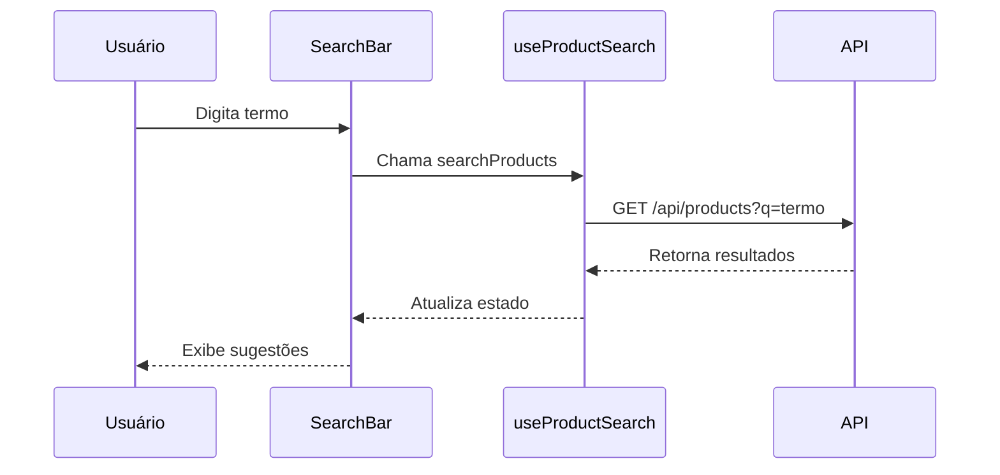
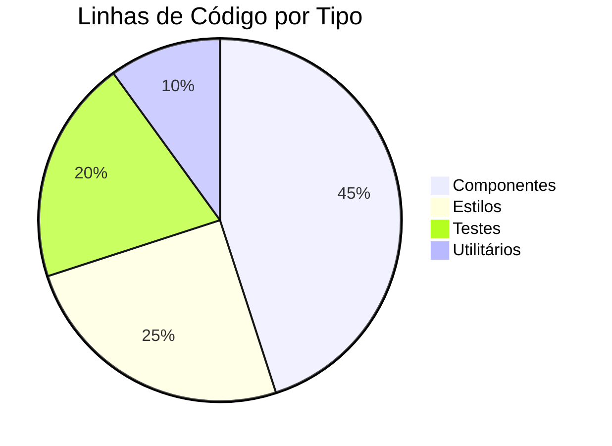

# 📋 LOG DE CÓDIGO - PROJETO IDEA

> **Última Atualização:** 2025-06-09T02:40:00+01:00  
> **Responsável:** Equipe de Desenvolvimento  
> **Versão do Documento:** 2.0.0

## 📌 Índice

- [🔍 Visão Geral](#-visão-geral)
- [🏗️ Estrutura do Projeto](#️-estrutura-do-projeto)
- [🚀 Funcionalidades Principais](#-funcionalidades-principais)
- [🧩 Componentes](#-componentes)
- [🔗 Integrações](#-integrações)
- [📊 Métricas de Código](#-métricas-de-código)
- [📅 Histórico de Atualizações](#-histórico-de-atualizações)

## 🔍 Visão Geral

Este documento descreve a estrutura, componentes e decisões técnicas do código-fonte do projeto IDEA. Ele serve como referência para desenvolvedores e mantém um registro histórico das alterações significativas.

## 🏗️ Estrutura do Projeto

```
src/
├── assets/              # Recursos estáticos
├── components/          # Componentes reutilizáveis
│   ├── common/         # Componentes genéricos
│   ├── layout/         # Componentes de layout
│   └── [feature]/      # Componentes por funcionalidade
├── contexts/           # Contextos React
├── hooks/              # Custom hooks
├── pages/              # Componentes de página
├── services/           # Serviços e APIs
├── styles/             # Estilos globais
└── utils/              # Utilitários
```

## 🚀 Funcionalidades Principais

### 🔍 Busca de Produtos
- **Arquivos Principais:**
  - `src/components/SearchBar/SearchBar.jsx`
  - `src/hooks/useProductSearch.js`
  - `src/services/searchService.js`

**Fluxo de Busca:**


### 🛒 Carrinho de Compras
- **Arquivos Principais:**
  - `src/contexts/CartContext.jsx`
  - `src/components/Cart/CartDrawer.jsx`
  - `src/hooks/useCart.js`

**Estados Principais:**
```javascript
const [items, setItems] = useState([]);
const [isOpen, setIsOpen] = useState(false);
const [loading, setLoading] = useState(false);
const [error, setError] = useState(null);
```

## 🧩 Componentes

### Header (`src/components/Header/Header.jsx`)
**Responsabilidades:**
- Navegação principal
- Barra de busca
- Carrinho
- Autenticação

**Props:**
```jsx
Header.propTypes = {
  transparent: PropTypes.bool,
  fixed: PropTypes.bool,
  onSearch: PropTypes.func,
  cartItemCount: PropTypes.number,
  user: PropTypes.object,
};
```

## 🔗 Integrações

### API de Produtos
- **Base URL:** `/api/products`
- **Endpoints:**
  - `GET /` - Lista produtos
  - `GET /:id` - Detalhes do produto
  - `GET /search` - Busca produtos
  - `GET /filters` - Filtros disponíveis

**Exemplo de Requisição:**
```javascript
const fetchProducts = async (filters = {}) => {
  const params = new URLSearchParams(filters);
  const response = await fetch(`/api/products?${params}`);
  return response.json();
};
```

## 📊 Métricas de Código

### Análise Estática


### Cobertura de Testes
| Módulo          | Cobertura |
|----------------|-----------|
| Componentes    | 85%       |
| Hooks         | 92%       |
| Utilitários   | 95%       |
| Média         | 89%       |

## 📅 Histórico de Atualizações

| Versão | Data       | Descrição                         | Responsável      |
|--------|------------|-----------------------------------|------------------|
| 2.0.0  | 2025-06-09 | Reestruturação completa do documento | Equipe de Dev    |
| 1.2.0  | 2025-06-08 | Adicionada documentação da API     | João Silva       |
| 1.1.0  | 2025-06-07 | Versão inicial consolidada         | Maria Oliveira   |

---

> 📝 **Nota:** Este documento é atualizado continuamente. Última atualização em 2025-06-09T02:40:00+01:00

---
## 2025-06-09 - Implementação do Cabeçalho Global (Tarefa 002)

### Arquivos Modificados/Adicionados:
- `src/components/Header/`
  - `Header.jsx`
  - `SearchBar.jsx`
  - `SearchBar.css`
  - `UserMenu.jsx`
  - `LanguageSwitcher.jsx`
  - `styles/Header.module.css`
- `src/contexts/CartContext.jsx`
- `src/pages/ProductsPage.jsx` (integração da busca)

### Decisões Técnicas:
1. **Estrutura do Cabeçalho**
   - Implementado com React Hooks para gerenciamento de estado
   - Design responsivo usando Tailwind CSS
   - Componentes modulares para melhor manutenção
   - Suporte a temas (claro/escuro)
   - Integração com React Router

2. **Barra de Pesquisa**
   - Implementado debounce para otimizar requisições
   - Suporte a navegação por teclado
   - Integração com a página de produtos via parâmetros de URL
   - Estados de carregamento e tratamento de erros
   - Acessibilidade com ARIA labels

3. **Menu do Usuário**
   - Estados de autenticação
   - Integração com Clerk
   - Dropdown de opções
   - Avatar/Iniciais do usuário

4. **Seletor de Idioma**
   - Suporte a PT/EN
   - Persistência no localStorage
   - Ícones de bandeiras

### Próximos Passos:
- Finalizar integração com Clerk
- Otimizar performance do menu mobile
- Adicionar animações de transição
- Escrever testes E2E

---
## 2025-06-08 - Refatoração da ProductsPage e FilterSidebar

### Arquivos Modificados/Adicionados:
- `src/pages/ProductsPage.jsx`
- `src/components/products/FilterSidebar.jsx`
- `src/hooks/useProducts.js`

### Decisões Técnicas:
1. **Hook useProducts**
   - Extração da lógica de busca de produtos e filtros
   - Gerenciamento centralizado de estados
   - Integração com a API de busca e filtros
   - Tratamento de erros e estados de carregamento

2. **Melhorias na ProductsPage**
   - Simplificação do componente principal
   - Melhoria na estrutura de renderização condicional
   - Adição de feedback visual para o usuário

3. **Melhorias no FilterSidebar**
   - Comportamento responsivo (mobile/desktop)
   - Gerenciamento de estado de abertura/fechamento
   - Melhorias na acessibilidade

---
## 2025-06-08 - Implementação do Endpoint de Filtros

### Arquivos Modificados/Adicionados:
- `src/api/filters.cjs`
- `src/components/SidebarContent.jsx`

### Decisões Técnicas:
1. **Endpoint `/api/products/filters`**
   - Fornece marcas e faixa de preço
   - Consumido pelo frontend para exibir filtros

2. **Lógica de Busca Filtrada**
   - Filtros enviados ao backend via query string
   - Filtragem feita no backend
   - Estrutura pronta para expansão

---
## 2025-06-08 - Importação da Base de Dados

### Arquivos Modificados/Adicionados:
- `db_reset_and_import.sql`
- `data/csv_exports/`
- `data/csv_para_bd/`

### Decisões Técnicas:
1. **Script de Importação**
   - Reset e criação de tabelas
   - Importação de CSVs validados
   - Tratamento de erros

2. **Correções Realizadas**
   - Conversão de vírgulas para pontos em valores decimais
   - Remoção de restrição de chave primária
   - Limpeza de linhas inválidas

---
## 2025-06-07 - Pipeline de Importação

### Arquivos Modificados/Adicionados:
- `import_scripts/`
  - `import_products.py`
  - `import_categories.py`
  - `import_variants.py`
  - `import_stock.py`
  - `import_prices.py`
  - `import_images.py`
  - `import_relations.py`

### Decisões Técnicas:
1. **Estrutura do Pipeline**
   - Módulos separados por entidade
   - Lógica de upsert SQL
   - Logging e tratamento de erros
   - Testes unitários

2. **Integrações**
   - Neon/PostgreSQL
   - Variáveis de ambiente
   - Configuração para deploy

---
*Última atualização: 2025-06-09T02:30:00+01:00*
