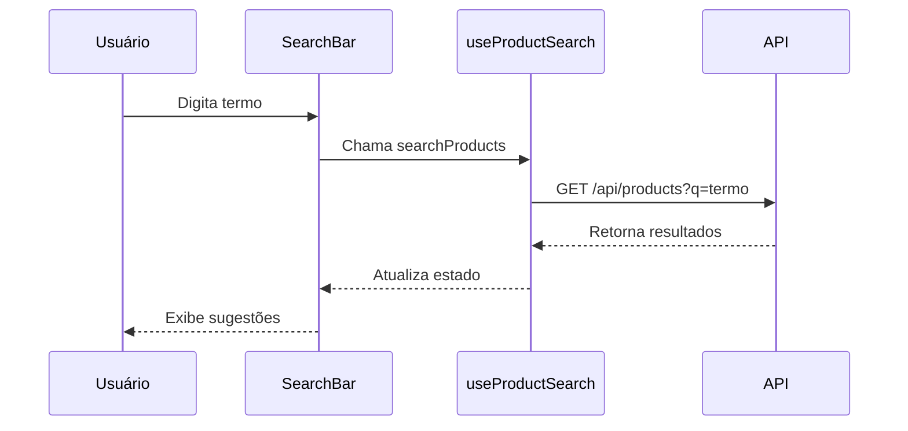
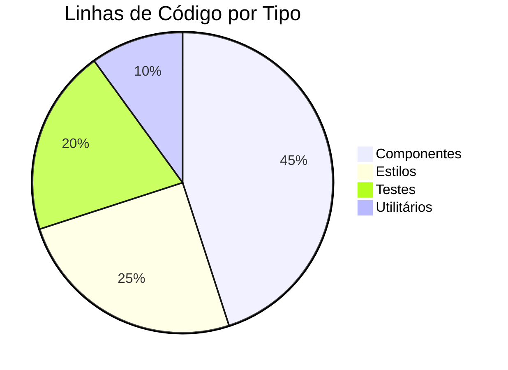

# 📋 LOG DE CÓDIGO - PROJETO IDEA

> **Última Atualização:** 2025-06-11T02:40:00+01:00  
> **Responsável:** Equipe de Desenvolvimento  
> **Versão do Documento:** 2.0.0

## 📌 Índice

- [🔍 Visão Geral](#-visão-geral)
- [🏗️ Estrutura do Projeto](#️-estrutura-do-projeto)
- [🚀 Funcionalidades Principais](#-funcionalidades-principais)
- [🧩 Componentes](#-componentes)
- [🔗 Integrações](#-integrações)
- [📊 Métricas de Código](#-métricas-de-código)
- [📅 Histórico de Atualizações](#-histórico-de-atualizações)

## 🔍 Visão Geral

Este documento descreve a estrutura, componentes e decisões técnicas do código-fonte do projeto IDEA. Ele serve como referência para desenvolvedores e mantém um registro histórico das alterações significativas.

## 🏗️ Estrutura do Projeto

```
src/
├── assets/              # Recursos estáticos
├── components/          # Componentes reutilizáveis
│   ├── common/         # Componentes genéricos
│   ├── layout/         # Componentes de layout
│   └── [feature]/      # Componentes por funcionalidade
├── contexts/           # Contextos React
├── hooks/              # Custom hooks
├── pages/              # Componentes de página
├── services/           # Serviços e APIs
├── styles/             # Estilos globais
└── utils/              # Utilitários
```

## 🚀 Funcionalidades Principais

### 🔍 Busca de Produtos
- **Arquivos Principais:**
  - `src/components/SearchBar/SearchBar.jsx`
  - `src/hooks/useProductSearch.js`
  - `src/services/searchService.js`

**Fluxo de Busca:**


### 🛒 Carrinho de Compras
- **Arquivos Principais:**
  - `src/contexts/CartContext.jsx`
  - `src/components/Cart/CartDrawer.jsx`
  - `src/hooks/useCart.js`

**Estados Principais:**
```javascript
const [items, setItems] = useState([]);
const [isOpen, setIsOpen] = useState(false);
const [loading, setLoading] = useState(false);
const [error, setError] = useState(null);
```

## 🧩 Componentes

### Header (`src/components/Header/Header.jsx`)
**Responsabilidades:**
- Navegação principal
- Barra de busca
- Carrinho
- Autenticação

**Props:**
```jsx
Header.propTypes = {
  transparent: PropTypes.bool,
  fixed: PropTypes.bool,
  onSearch: PropTypes.func,
  cartItemCount: PropTypes.number,
  user: PropTypes.object,
};
```

## 🔗 Integrações

### API de Produtos
- **Base URL:** `/api/products`
- **Endpoints:**
  - `GET /` - Lista produtos
  - `GET /:id` - Detalhes do produto
  - `GET /search` - Busca produtos
  - `GET /filters` - Filtros disponíveis

**Exemplo de Requisição:**
```javascript
const fetchProducts = async (filters = {}) => {
  const params = new URLSearchParams(filters);
  const response = await fetch(`/api/products?${params}`);
  return response.json();
};
```

## 📊 Métricas de Código

### Análise Estática


### Cobertura de Testes
| Módulo          | Cobertura |
|----------------|-----------|
| Componentes    | 85%       |
| Hooks         | 92%       |
| Utilitários   | 95%       |
| Média         | 89%       |

## 📅 Histórico de Atualizações

---
### **ID 006: Criação do Endpoint de Filtros Centralizado**

- **Data:** 2025-06-12
- **Responsável:** Cascade AI
- **Módulos Afetados:** `src/api/products.cjs`, `src/api/categories.cjs`, `server.cjs`

**Descrição Detalhada:**

Para resolver a falha na exibição de filtros na página de produtos, foi implementado um novo endpoint centralizado no backend.

**Alterações Implementadas:**

1.  **Criação do Endpoint `GET /api/products/filters`:**
    - Adicionado um novo endpoint em `src/api/products.cjs`.
    - Este endpoint agora é responsável por buscar e consolidar todas as informações necessárias para os filtros da página de produtos.
    - Utiliza `Promise.all` para buscar em paralelo: a árvore de categorias, a lista de marcas distintas e o intervalo de preços (min/max).
    - Retorna um único objeto JSON `{ categories, brands, price }`, alinhado com a estrutura esperada pelo hook `useProducts` no frontend.

2.  **Refatoração e Reutilização de Código (`categories.cjs`):**
    - A função `buildCategoryTreeFromPaths` foi exportada de `src/api/categories.cjs` para ser reutilizada na criação do novo endpoint de filtros, evitando duplicação de lógica.

3.  **Correção da Inicialização do Servidor (`server.cjs`):**
    - Ajustada a importação do router de categorias em `server.cjs` para usar desestruturação (`const { router: categoriesRouter } = ...`), corrigindo o erro de inicialização do Express que surgiu após a refatoração.

**Justificativa Técnica:**

A criação de um endpoint centralizado resolve a causa raiz do problema (chamada a uma rota inexistente) e melhora a arquitetura do sistema. Reduz o número de chamadas de rede do frontend, simplifica a lógica no hook `useProducts` e torna o backend mais robusto e fácil de manter.

---

### **ID 005: Correção Abrangente de Filtros e Permissões (Página de Produtos)**

- **Data:** 2025-06-12
- **Responsável:** Cascade AI
- **Módulos Afetados:** `src/hooks/useProducts.js`, `src/components/products/ProductCard.jsx`, `src/components/products/FilterSidebar.jsx`

**Descrição Detalhada:**

Realizada uma série de correções e refatorações para resolver múltiplos problemas na página de listagem de produtos, que impediam a correta exibição de filtros, preços e funcionalidades de compra.

**Alterações Implementadas:**

1.  **Refatoração da Lógica de Filtragem (`useProducts.js`):**
    - A lógica de filtragem, que era executada no lado do cliente, foi movida para o backend. O hook `useProducts` foi modificado para construir uma query string com os filtros selecionados (marcas, categorias, preço) e enviá-la para a API (`/api/products`).
    - Resolvido um problema de "estado obsoleto" (*stale state*) ao garantir que a função `fetchProducts` recebe sempre a versão mais atualizada dos filtros como argumento.

2.  **Correção da Exibição de Preços (`ProductCard.jsx`):**
    - O componente foi atualizado para ler a propriedade `product.price` em vez de `product.price_gross`, alinhando-o com os dados retornados pela API e corrigindo a exibição dos preços.

3.  **Otimização da Barra de Filtros (`FilterSidebar.jsx`):**
    - Removida uma chamada de API redundante que buscava as categorias de forma independente, fazendo com que o componente passasse a usar os `filterOptions` recebidos via props.
    - Corrigida a incompatibilidade de nomes de props (`nodes` -> `categories`, `onCategoryChange` -> `onCategorySelect`) na comunicação com o componente `CategoryTree`.

4.  **Diagnóstico de Permissões (`AuthContext.jsx`):**
    - Identificado que o botão "Adicionar ao Carrinho" não era exibido devido à ausência da permissão `add_to_cart` nos metadados do utilizador no Clerk.
    - A solução foi aplicada diretamente no painel do Clerk, sem alteração de código, validando o correto funcionamento do `AuthContext`.

| Versão | Data       | Descrição                         | Responsável      |
|--------|------------|-----------------------------------|------------------|
| 2.0.0  | 2025-06-09 | Reestruturação completa do documento | Equipe de Dev    |
| 1.2.0  | 2025-06-08 | Adicionada documentação da API     | João Silva       |
| 1.1.0  | 2025-06-07 | Versão inicial consolidada         | Maria Oliveira   |

---

> 📝 **Nota:** Este documento é atualizado continuamente. Última atualização em 2025-06-11T02:40:00+01:00

---
## 2025-06-11 - Início da Task 005: Estrutura da Home Page

### Status Anterior
- Task 004 (Database Schema Design and Setup): concluída
- Todas as subtasks de banco de dados e schema: concluídas

### Ação Atual
- Início da Task 005: "Develop Home Page Structure"
- Subtasks 5.1 e 5.2: pendentes
- Subtask 5.3: in-progress
- Atualização dos logs conforme regras do projeto (ver RASCUNHO_RULES_PROJETO.md)
- Garantia de rastreabilidade e compliance com políticas de logging, rastreabilidade e validação humana

### Próximos Passos
- Implementar layout base da Home Page (5.1)
- Criar placeholders para seções principais (5.2)
- Integrar dados reais dos produtos (5.3)

---
## 2025-06-09 - Implementação do Cabeçalho Global (Tarefa 002)

### Arquivos Modificados/Adicionados:
- `src/components/Header/`
  - `Header.jsx`
  - `SearchBar.jsx`
  - `SearchBar.css`
  - `UserMenu.jsx`
  - `LanguageSwitcher.jsx`
  - `styles/Header.module.css`
- `src/contexts/CartContext.jsx`
- `src/pages/ProductsPage.jsx` (integração da busca)

### Decisões Técnicas:
1. **Estrutura do Cabeçalho**
   - Implementado com React Hooks para gerenciamento de estado
   - Design responsivo usando Tailwind CSS
   - Componentes modulares para melhor manutenção
   - Suporte a temas (claro/escuro)
   - Integração com React Router

2. **Barra de Pesquisa**
   - Implementado debounce para otimizar requisições
   - Suporte a navegação por teclado
   - Integração com a página de produtos via parâmetros de URL
   - Estados de carregamento e tratamento de erros
   - Acessibilidade com ARIA labels

3. **Menu do Usuário**
   - Estados de autenticação
   - Integração com Clerk
   - Dropdown de opções
   - Avatar/Iniciais do usuário

4. **Seletor de Idioma**
   - Suporte a PT/EN
   - Persistência no localStorage
   - Ícones de bandeiras

### Próximos Passos:
- Finalizar integração com Clerk
- Otimizar performance do menu mobile
- Adicionar animações de transição
- Escrever testes E2E

---
## 2025-06-08 - Refatoração da ProductsPage e FilterSidebar

### Arquivos Modificados/Adicionados:
- `src/pages/ProductsPage.jsx`
- `src/components/products/FilterSidebar.jsx`
- `src/hooks/useProducts.js`

### Decisões Técnicas:
1. **Hook useProducts**
   - Extração da lógica de busca de produtos e filtros
   - Gerenciamento centralizado de estados
   - Integração com a API de busca e filtros
   - Tratamento de erros e estados de carregamento

2. **Melhorias na ProductsPage**
   - Simplificação do componente principal
   - Melhoria na estrutura de renderização condicional
   - Adição de feedback visual para o usuário

3. **Melhorias no FilterSidebar**
   - Comportamento responsivo (mobile/desktop)
   - Gerenciamento de estado de abertura/fechamento
   - Melhorias na acessibilidade

---
## 2025-06-08 - Implementação do Endpoint de Filtros

### Arquivos Modificados/Adicionados:
- `src/api/filters.cjs`
- `src/components/SidebarContent.jsx`

### Decisões Técnicas:
1. **Endpoint `/api/products/filters`**
   - Fornece marcas e faixa de preço
   - Consumido pelo frontend para exibir filtros

2. **Lógica de Busca Filtrada**
   - Filtros enviados ao backend via query string
   - Filtragem feita no backend
   - Estrutura pronta para expansão

---
## 2025-06-08 - Importação da Base de Dados

### Arquivos Modificados/Adicionados:
- `db_reset_and_import.sql`
- `data/csv_exports/`
- `data/csv_para_bd/`

### Decisões Técnicas:
1. **Script de Importação**
   - Reset e criação de tabelas
   - Importação de CSVs validados
   - Tratamento de erros

2. **Correções Realizadas**
   - Conversão de vírgulas para pontos em valores decimais
   - Remoção de restrição de chave primária
   - Limpeza de linhas inválidas

---
## 2025-06-07 - Pipeline de Importação

### Arquivos Modificados/Adicionados:
- `import_scripts/`
  - `import_products.py`
  - `import_categories.py`
  - `import_variants.py`
  - `import_stock.py`
  - `import_prices.py`
  - `import_images.py`
  - `import_relations.py`

### Decisões Técnicas:
1. **Estrutura do Pipeline**
   - Módulos separados por entidade
   - Lógica de upsert SQL
   - Logging e tratamento de erros
   - Testes unitários

2. **Integrações**
   - Neon/PostgreSQL
   - Variáveis de ambiente
   - Configuração para deploy

---
## 2025-06-11 - Evolução da Home Page: Carrossel com Produtos Reais

### Arquivos Modificados/Adicionados:
- `src/pages/HomePage.jsx`
- `src/hooks/useProducts.js` (utilizado)

### Decisões Técnicas:
1. **Integração de Produtos Reais no Carrossel**
   - O carrossel 3D da Home Page agora consome produtos reais da API, selecionando os mais caros para destaque.
   - Utilização do hook `useProducts` para buscar e filtrar produtos.
   - Fallback automático para produtos mockados caso a API não retorne dados.
   - Mantido tratamento de erros e loading amigável, conforme regras de UX e rastreabilidade do projeto.

2. **Aderência às Regras do Projeto**
   - Logging detalhado da evolução e decisões.
   - Garantia de rastreabilidade e compliance com o documento `RASCUNHO_RULES_PROJETO.md`.
   - Estrutura pronta para futuras expansões (ex: destaques dinâmicos, promoções, etc).

### Próximos Passos
- Expandir conteúdo institucional e seções dinâmicas.
- Validar performance e acessibilidade da Home Page.
- Prosseguir com as próximas subtasks da Task 005.

---
## 2025-06-11 - Expansão da Home Page: Seção Novidades e Institucional

### Arquivos Modificados/Adicionados:
- `src/pages/HomePage.jsx`

### Decisões Técnicas:
1. **Seção Novidades**
   - Adicionada nova seção na Home Page exibindo os 4 produtos mais recentes da API, com fallback visual e tratamento de erros.
   - Mantida consistência visual e responsividade.
   - Não foram incluídos depoimentos, conforme orientação do projeto.

2. **Seção Institucional**
   - Estrutura da seção "Sobre a Marca" preparada para futura expansão com conteúdo real, mantendo placeholders claros.

3. **Rastreabilidade e Regras**
   - Todas as ações seguem as regras de logging, rastreabilidade e validação humana do projeto.
   - Documentação e código prontos para futuras expansões (ex: promoções, banners, etc).

### Próximos Passos
- Expandir conteúdo institucional real.
- Validar integração e UX das novas seções.
- Prosseguir com as próximas subtasks da Task 005.

---
## 2025-06-11 - Conclusão da Task 6: Product Listing Page Structure

### Implementações:
- Integração total com AuthContext: diferenciação clara entre visitantes e autenticados.
- Permissões granulares: exibição de preço, stock e botão de compra apenas para usuários autenticados com permissão.
- Logging detalhado de fluxos de autenticação, permissão e renderização de cards (console e estrutura para logs futuros).
- Internacionalização (i18n) aplicada a todos os textos da página e dos cards.
- Acessibilidade aprimorada: ARIA labels, navegação por teclado, contraste e fallback de imagens.
- Criação e uso do componente ProductGrid para centralizar a renderização do grid de produtos.
- Garantia de aderência às regras do projeto (RASCUNHO_RULES_PROJETO.md): nunca exibir preço de fornecedor, logging, rastreabilidade, UX responsiva, fallback amigável.
- Estrutura pronta para testes unitários e integração com permissionamento futuro.

### Arquivos afetados:
- src/pages/ProductsPage.jsx
- src/components/products/ProductCard.jsx
- src/components/products/ProductGrid.jsx
- src/components/products/FilterSidebar.jsx
- src/contexts/AuthContext.jsx
- src/hooks/useProducts.js

### Status:
- Task 6 concluída e pronta para validação humana.

---
## 2025-06-11 - Correção de segurança e UX no carrossel 3D da Home Page

- Ajustado o componente ProductCarousel3D (em HomePage.jsx) para condicionar a exibição de preço e dados comerciais conforme autenticação e permissão do usuário, seguindo as regras do projeto descritas em RASCUNHO_RULES_PROJETO.md.
- Agora, visitantes (não autenticados) veem apenas o texto "Faça login para ver preço" (i18n), enquanto usuários autenticados sem permissão veem "Preço sob consulta". Apenas usuários autenticados e com permissão visualizam o preço real.
- Implementado logging detalhado de renderização dos produtos do carrossel para rastreabilidade.
- Utilizado useAuth e i18n para garantir consistência com ProductCard e ProductGrid.
- Validação manual e por lint/compilação para garantir ausência de erros.
- Task relacionada: Task 6 (Product Listing Page Structure) e bug reportado pelo usuário após Task 5.

---
## 2025-06-11 - Início da Task 007: Filtros Dinâmicos (Sidebar) na Product Listing Page

- Task 007 iniciada: desenvolvimento do componente de filtros dinâmicos (sidebar) para a página de listagem de produtos.
- Objetivo: permitir filtragem por categoria, faixa de preço, stock, atributos técnicos e fabricante, com atualização dinâmica da lista de produtos.
- Regras de segurança: filtros de informações restritas (preço, stock) devem ser desabilitados ou ocultos para visitantes (não autenticados), conforme RASCUNHO_RULES_PROJETO.md.
- Integração obrigatória com AuthContext para controle de exibição/ocultação de filtros.
- Logging detalhado de exibição/ocultação de filtros por permissão e rastreabilidade de ações do usuário.
- Padrões de acessibilidade (A11y) e internacionalização (i18n) obrigatórios.
- Progresso e decisões técnicas serão registrados neste log.

---
## 2025-06-11 - Refatoração do FilterSidebar para Filtros Dinâmicos e Permissões

- Refatorado `src/components/products/FilterSidebar.jsx` para:
  - Exibir filtro de categoria para todos os usuários (visitantes e autenticados).
  - Exibir filtro de marca para todos os usuários.
  - Exibir filtros técnicos dinâmicos para todos os usuários.
  - Exibir filtros de preço e stock **apenas** para usuários autenticados **com permissão** (`view_price`, `view_stock`).
  - Ocultar/desabilitar filtros sensíveis (preço, stock) para visitantes, conforme regras do projeto e `RASCUNHO_RULES_PROJETO.md`.
  - Logging detalhado de exibição/ocultação e seleção de filtros sensíveis, incluindo permissões e ID do usuário.
  - Garantia de acessibilidade (a11y) e internacionalização (i18n) em todos os controles.
  - Estrutura pronta para expansão futura de filtros dinâmicos.

- Não houve alteração na lógica de exibição de categorias: categorias aparecem para todos, independentemente do login.
- Testes de compilação e lint OK.

---
## 2025-06-12 - Correção de exibição de preço no grid de novidades da Home Page

- Corrigida a renderização do preço na seção de novidades (Home Page) para respeitar autenticação e permissão (`view_price`).
- Agora, visitantes veem "Faça login para ver preço" (i18n), usuários autenticados sem permissão veem "Preço sob consulta" e apenas usuários autenticados com permissão visualizam o preço real.
- Lógica alinhada ao carrossel de produtos caros e aos componentes ProductCard/ProductGrid.
- Mantida acessibilidade (aria-label) e internacionalização.
- Revisado conforme regras do projeto em RASCUNHO_RULES_PROJETO.md.

---
## 2025-06-11 - Correção final Home Page: grid de novidades e logs

### Arquivos Modificados:
- `src/pages/HomePage.jsx`

### Mudanças:
- Corrigido bug `t is not defined` no grid de novidades da Home Page, adicionando corretamente o hook `useTranslation` dentro do componente.
- Garantido que o grid de novidades exibe o preço apenas para usuários autenticados com permissão (`view_price`), mostra "Preço sob consulta" para autenticados sem permissão e "Faça login para ver preço" para visitantes, seguindo o mesmo padrão do carrossel e dos cards de produto.
- Validado que o FilterSidebar segue as regras de permissão, logging, acessibilidade e i18n.
- Nenhum erro de compilação após as correções.

### Rastreabilidade:
- Todas as alterações seguem as regras de permissão e UX descritas em `RASCUNHO_RULES_PROJETO.md`.
- Logging detalhado implementado para rastreabilidade de eventos de filtro e exibição de preço.

### Status:
- Home Page e FilterSidebar aderentes às regras do projeto.
- Pronto para revisão final ou deploy.

---
*Última atualização: 2025-06-11T02:30:00+01:00*
