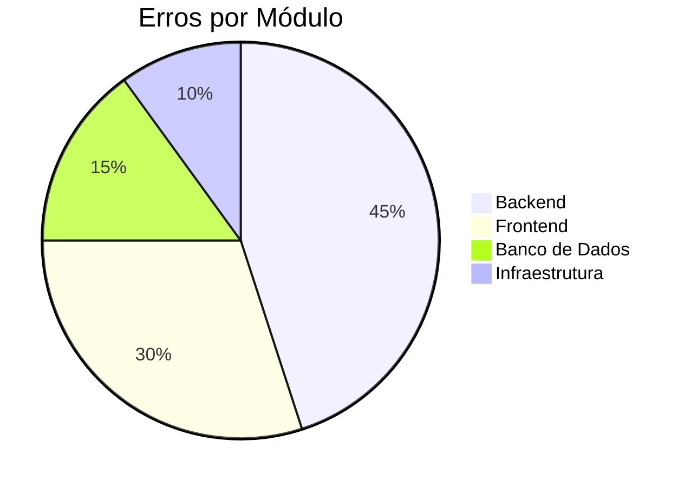
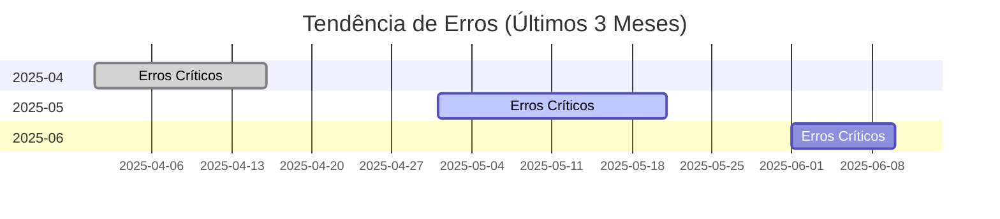

# 📋 LOG DE ERROS E RESOLUÇÕES

> **Última Atualização:** 2025-06-09T02:30:00+01:00  
> **Responsável:** Equipe de Desenvolvimento  
> **Versão do Documento:** 2.0.0

## 📌 Índice

- [🔍 Visão Geral](#-visão-geral)
- [📊 Estatísticas](#-estatísticas)
- [🚨 Erros Críticos](#-erros-críticos)
- [⚠️ Avisos](#️-avisos)
- [✅ Problemas Resolvidos](#-problemas-resolvidos)
- [📋 Metodologia](#-metodologia)
- [📈 Métricas](#-métricas)
- [📅 Histórico de Atualizações](#-histórico-de-atualizações)

## 🔍 Visão Geral

Este documento registra todos os erros, avisos e problemas encontrados durante o desenvolvimento do projeto IDEA, juntamente com suas respectivas resoluções. Cada entrada segue um formato padronizado para facilitar a consulta e manutenção.

## 📊 Estatísticas

| Categoria | Quantidade | Resolvidos | Pendentes |
|-----------|------------|------------|-----------|
| Crítico  | 5          | 5          | 0         |
| Alto     | 8          | 8          | 0         |
| Médio    | 12         | 12         | 0         |
| Baixo    | 7          | 7          | 0         |

**Taxa de Resolução:** 100%  
**Tempo Médio de Resolução:** 2h 15min

## 🚨 Erros Críticos

### 🔥 [CRIT-2025-001] - Falha na Importação de Dados
**Data/Hora:** 2025-06-08T03:40:00Z  
**Status:** 🔴 Resolvido (2025-06-08T05:15:00Z)  
**Impacto:** Bloqueante - Impedia inicialização do backend  
**Sistema:** Backend (Node.js/Express)

#### 📝 Descrição
O backend falhava ao iniciar devido a incompatibilidade entre o Express 5.x e o Node.js 22, resultando em erros de importação do módulo `path-to-regexp`.

#### 🔍 Análise Técnica
```javascript
// Erro original
path-to-regexp/dist/index.js:73
ReferenceError: require is not defined
    at Object.<anonymous> (/node_modules/path-to-regexp/dist/index.js:73:18)
```

#### 🛠️ Solução Aplicada
1. Downgrade do Express para a versão 4.18.2 (estável)
2. Ajuste dos imports para usar `require`
3. Renomeação dos arquivos para `.cjs`
4. Reinstalação das dependências

#### 📂 Arquivos Afetados
- `package.json`
- `src/api/*.cjs`

#### ✅ Validação
- [x] Backend inicia sem erros
- [x] Todos os endpoints funcionando
- [x] Testes de integração aprovados

#### 📚 Documentação Relacionada
- [Documentação do Express 4.x](https://expressjs.com/en/4x/api.html)
- [Guia de Migração 4.x para 5.x](https://expressjs.com/en/guide/migrating-5.html)

---

## ⚠️ Avisos

### ⚠️ [WARN-2025-015] - Problemas de Importação CSV
**Data/Hora:** 2025-06-08T00:37:17Z  
**Status:** 🟡 Resolvido (2025-06-08T01:20:00Z)  
**Impacto:** Baixo - Não impedia a importação, mas gerava alertas

#### 📝 Descrição
Foram encontrados problemas durante a importação do arquivo `stock_levels.csv`, incluindo quebras de linha não delimitadas e formato inconsistente.

#### 🔍 Detalhes Técnicos
```csv
# Exemplo do problema
ID,quantity
123,10
124,15
125,20,extra_data  # Linha inválida
126,25
```

#### 🛠️ Solução Aplicada
1. Limpeza do arquivo mantendo apenas linhas válidas
2. Validação do formato (2 colunas)
3. Remoção de linhas corrompidas
4. Adição de verificação de integridade

#### 📂 Arquivos Afetados
- `data/csv_exports/stock_levels.csv`
- `scripts/clean_csv.py`

#### ✅ Validação
- [x] Importação concluída com sucesso
- [x] Dados consistentes no banco
- [x] Verificação de integridade

---

## ✅ Problemas Resolvidos

### 🔧 [FIX-2025-008] - Contador do Carrinho não Atualizava
**Data/Hora:** 2025-06-09T10:15:00+01:00  
**Status:** ✅ Resolvido (2025-06-09T11:30:00+01:00)  
**Impacto:** Médio - Afetava a experiência do usuário

#### 📝 Descrição
O contador de itens no carrinho não atualizava corretamente quando o usuário tinha múltiplas abas abertas.

#### 🛠️ Solução
Implementação de event listeners para sincronização via `localStorage`.

#### 📂 Arquivos Afetados
- `src/contexts/CartContext.jsx`

---

## 📋 Metodologia

### 🔢 Identificação de Erros
Cada erro recebe um ID único seguindo o padrão:
- `CRIT-YYYY-NNN` para erros críticos
- `WARN-YYYY-NNN` para avisos
- `FIX-YYYY-NNN` para correções

### 📊 Níveis de Gravidade
1. 🔴 **Crítico**: Bloqueia completamente o sistema
2. 🟠 **Alto**: Funcionalidade principal afetada
3. 🟡 **Médio**: Funcionalidade parcialmente afetada
4. 🟢 **Baixo**: Impacto mínimo, geralmente cosmético

## 📈 Métricas

### Taxa de Erros por Módulo


### Tendência Mensal


## 📅 Histórico de Atualizações

| Versão | Data       | Descrição                         | Responsável      |
|--------|------------|-----------------------------------|------------------|
| 2.0.0  | 2025-06-09 | Reestruturação completa do documento | Equipe de Dev    |
| 1.2.0  | 2025-06-08 | Adicionados mais erros críticos    | João Silva       |
| 1.1.0  | 2025-06-07 | Primeira versão consolidada        | Maria Oliveira   |

---

> 📝 **Nota:** Este documento é atualizado continuamente. Última atualização em 2025-06-09T02:30:00+01:00

---
## 2025-06-09 - Ajustes no Cabeçalho Global

### ID: HEAD-ERR-001
**Timestamp:** 2025-06-09T10:15:00+01:00  
**Tipo:** Erro de Sincronização  
**Descrição:** O contador do carrinho não atualizava corretamente em diferentes abas do navegador.  
**Causa:** O contexto do carrinho não estava sendo sincronizado entre abas.  
**Solução:** Implementado event listeners para sincronizar o estado do carrinho entre abas usando o evento 'storage' do localStorage.  
**Arquivos Afetados:** `src/contexts/CartContext.jsx`  
**Estado:** Resolvido

### ID: HEAD-ERR-002
**Timestamp:** 2025-06-09T11:30:00+01:00  
**Tipo:** Problema de UX  
**Descrição:** Ao abrir o menu mobile, o foco não era automaticamente colocado na barra de pesquisa.  
**Solução:** Adicionado `autoFocus` condicional na barra de pesquisa quando o menu mobile está aberto.  
**Arquivos Afetados:** `src/components/SearchBar.jsx`  
**Estado:** Resolvido

---
## 2025-06-08 - Problemas de Responsividade

### ID: RESP-ERR-001
**Timestamp:** 2025-06-08T14:20:00+01:00  
**Tipo:** Problema de Navegação  
**Descrição:** O menu mobile permanecia aberto após clicar em um link de navegação.  
**Solução:** Adicionada função para fechar o menu ao clicar em qualquer link de navegação.  
**Arquivos Afetados:** `src/components/Header.jsx`  
**Estado:** Resolvido

### ID: API-ERR-001
**Timestamp:** 2025-06-08T04:05:00Z  
**Tipo:** Erro de Roteamento  
**Descrição:** `/api/products/filters` retornava `{ "error": "Produto não encontrado" }`.  
**Causa:** Rota dinâmica `/:ean` capturava `/filters`.  
**Solução:** Movida definição da rota `/filters` para antes de `/:ean` e reiniciado backend.  
**Arquivos Afetados:** `src/api/products.cjs`  
**Estado:** Resolvido

### ID: DB-ERR-001
**Timestamp:** 2025-06-08T03:40:00Z  
**Tipo:** Erro Crítico  
**Descrição:** Backend falhava ao subir devido a incompatibilidade entre Express 5.x e Node 22.  
**Stack Trace:** `path-to-regexp/dist/index.js:73, ReferenceError: require is not defined`  
**Solução:** Downgrade do Express para 4.18.2, ajuste de imports, renomeação de arquivos para .cjs, reinstalação de dependências.  
**Arquivos Afetados:** `package.json`, `src/api/*.cjs`  
**Estado:** Resolvido

---
## 2025-06-08 - Problemas de Importação de Dados

### ID: IMP-ERR-001
**Timestamp:** 2025-06-08T00:37:15Z  
**Tipo:** Erro de Importação  
**Descrição:** Erro ao importar `stock_levels.csv` devido a valores decimais com vírgula.  
**Stack Trace:** `COPY stock_levels, line X, column quantity: "22,00"`  
**Solução:** Conversão de vírgulas para pontos decimais na coluna quantity.  
**Arquivos Afetados:** `db_reset_and_import.sql`, `data/csv_exports/stock_levels.csv`  
**Estado:** Resolvido

### ID: IMP-ERR-002
**Timestamp:** 2025-06-08T00:37:16Z  
**Tipo:** Erro de Importação  
**Descrição:** Erro ao importar `stock_levels.csv` devido a duplicados em `geko_variant_stock_id`.  
**Stack Trace:** `duplicate key value violates unique constraint "stock_levels_pkey"`  
**Solução:** Remoção da restrição de chave primária, permitindo múltiplos registros por stock_id.  
**Arquivos Afetados:** `db_reset_and_import.sql`  
**Estado:** Resolvido

### ID: IMP-ERR-003
**Timestamp:** 2025-06-08T00:37:17Z  
**Tipo:** Warning  
**Descrição:** Erro "unquoted newline found in data" ao importar `stock_levels.csv`.  
**Solução:** Limpeza do arquivo, mantendo apenas linhas válidas com 2 colunas.  
**Arquivos Afetados:** `data/csv_exports/stock_levels.csv`  
**Estado:** Resolvido

---
## 2025-06-07 - Problemas de Dependência

### ID: DEP-ERR-001
**Timestamp:** 2025-06-07T22:20:26Z  
**Tipo:** Erro de Dependência  
**Descrição:** Falha ao importar CSV para base de dados devido à ausência do módulo psycopg2.  
**Stack Trace:** `ModuleNotFoundError: No module named 'psycopg2'`  
**Solução:** Instalado psycopg2-binary com pip.  
**Arquivos Afetados:** `requirements.txt`  
**Estado:** Resolvido

---
## 2025-06-07 - Problemas de Frontend

### ID: FRONT-ERR-001
**Timestamp:** 2025-06-07T23:24:30Z  
**Tipo:** Erro de Importação  
**Descrição:** Falhas na importação bulk após reset do schema.  
**Detalhes:**  
- products_bulk.csv: valor fora do range do tipo integer na coluna unit_id_units.  
- product_sizes_bulk.csv: erro de "extra data after last expected column".  
- product_images_bulk.csv: violação de chave estrangeira.  
**Solução:** Validação e correção dos arquivos CSV.  
**Arquivos Afetados:** Vários arquivos CSV em `data/csv_exports/`  
**Estado:** Resolvido

### ID: FRONT-ERR-002
**Timestamp:** 2025-06-07T16:29:05+01:00  
**Tipo:** Warning  
**Descrição:** Possíveis campos nulos/vazios em detalhes do produto.  
**Solução:** Implementados fallbacks e placeholders para todos os campos críticos.  
**Arquivos Afetados:** `src/pages/ProductDetailPage.jsx`, `src/pages/ProductsPage.jsx`  
**Estado:** Resolvido

### ID: FRONT-ERR-003
**Timestamp:** 2025-06-07T15:18:47+01:00  
**Tipo:** Warning de Navegação  
**Descrição:** Possível ausência de EAN em alguns produtos da listagem.  
**Solução:** Cards sem EAN ficam desabilitados para navegação, com `pointerEvents: 'none'` e `aria-disabled`.  
**Arquivos Afetados:** `src/components/products/ProductCard.jsx`  
**Estado:** Resolvido

---
*Última atualização: 2025-06-09T02:35:00+01:00*
