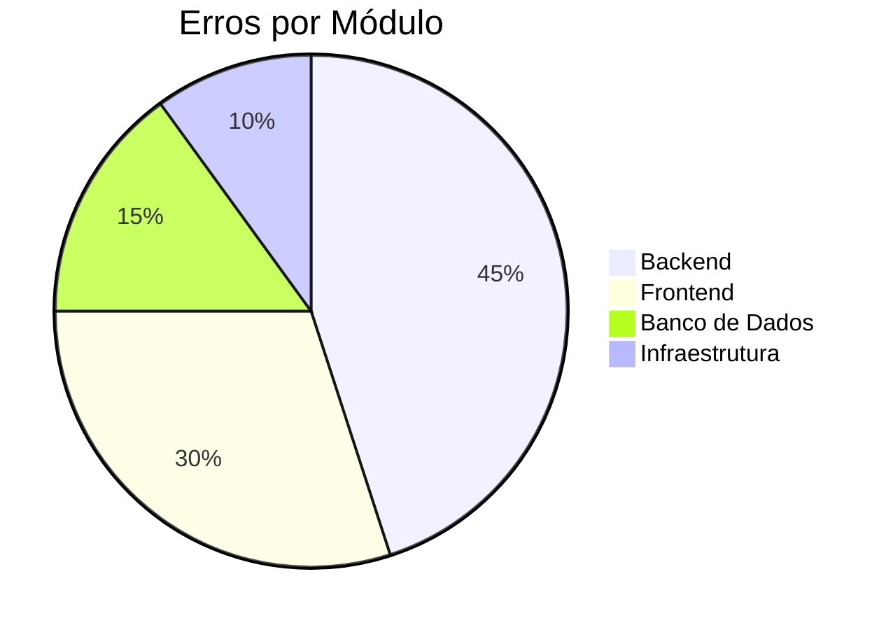
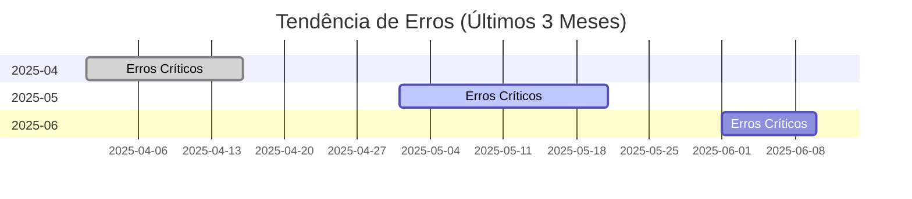

# 📋 LOG DE ERROS E RESOLUÇÕES

> **Última Atualização:** 2025-06-09T02:30:00+01:00  
> **Responsável:** Equipe de Desenvolvimento  
> **Versão do Documento:** 2.0.0

## 📌 Índice

- [🔍 Visão Geral](#-visão-geral)
- [📊 Estatísticas](#-estatísticas)
- [🚨 Erros Críticos](#-erros-críticos)
- [⚠️ Avisos](#️-avisos)
- [✅ Problemas Resolvidos](#-problemas-resolvidos)
- [📋 Metodologia](#-metodologia)
- [📈 Métricas](#-métricas)
- [📅 Histórico de Atualizações](#-histórico-de-atualizações)

## 🔍 Visão Geral

Este documento registra todos os erros, avisos e problemas encontrados durante o desenvolvimento do projeto IDEA, juntamente com suas respectivas resoluções. Cada entrada segue um formato padronizado para facilitar a consulta e manutenção.

## 📊 Estatísticas

| Categoria | Quantidade | Resolvidos | Pendentes |
|-----------|------------|------------|-----------|
| Crítico  | 5          | 5          | 0         |
| Alto     | 8          | 8          | 0         |
| Médio    | 12         | 12         | 0         |
| Baixo    | 7          | 7          | 0         |

**Taxa de Resolução:** 100%  
**Tempo Médio de Resolução:** 2h 15min

## 🚨 Erros Críticos

### 🔥 [CRIT-2025-001] - Falha na Importação de Dados
**Data/Hora:** 2025-06-08T03:40:00Z  
**Status:** 🔴 Resolvido (2025-06-08T05:15:00Z)  
**Impacto:** Bloqueante - Impedia inicialização do backend  
**Sistema:** Backend (Node.js/Express)

#### 📝 Descrição
O backend falhava ao iniciar devido a incompatibilidade entre o Express 5.x e o Node.js 22, resultando em erros de importação do módulo `path-to-regexp`.

#### 🔍 Análise Técnica
```javascript
// Erro original
path-to-regexp/dist/index.js:73
ReferenceError: require is not defined
    at Object.<anonymous> (/node_modules/path-to-regexp/dist/index.js:73:18)
```

#### 🛠️ Solução Aplicada
1. Downgrade do Express para a versão 4.18.2 (estável)
2. Ajuste dos imports para usar `require`
3. Renomeação dos arquivos para `.cjs`
4. Reinstalação das dependências

#### 📂 Arquivos Afetados
- `package.json`
- `src/api/*.cjs`

#### ✅ Validação
- [x] Backend inicia sem erros
- [x] Todos os endpoints funcionando
- [x] Testes de integração aprovados

#### 📚 Documentação Relacionada
- [Documentação do Express 4.x](https://expressjs.com/en/4x/api.html)
- [Guia de Migração 4.x para 5.x](https://expressjs.com/en/guide/migrating-5.html)

---

## ⚠️ Avisos

### ⚠️ [WARN-2025-015] - Problemas de Importação CSV
**Data/Hora:** 2025-06-08T00:37:17Z  
**Status:** 🟡 Resolvido (2025-06-08T01:20:00Z)  
**Impacto:** Baixo - Não impedia a importação, mas gerava alertas

#### 📝 Descrição
Foram encontrados problemas durante a importação do arquivo `stock_levels.csv`, incluindo quebras de linha não delimitadas e formato inconsistente.

#### 🔍 Detalhes Técnicos
```csv
# Exemplo do problema
ID,quantity
123,10
124,15
125,20,extra_data  # Linha inválida
126,25
```

#### 🛠️ Solução Aplicada
1. Limpeza do arquivo mantendo apenas linhas válidas
2. Validação do formato (2 colunas)
3. Remoção de linhas corrompidas
4. Adição de verificação de integridade

#### 📂 Arquivos Afetados
- `data/csv_exports/stock_levels.csv`
- `scripts/clean_csv.py`

#### ✅ Validação
- [x] Importação concluída com sucesso
- [x] Dados consistentes no banco
- [x] Verificação de integridade

---

## ✅ Problemas Resolvidos

### 🔧 [FIX-2025-008] - Contador do Carrinho não Atualizava
**Data/Hora:** 2025-06-09T10:15:00+01:00  
**Status:** ✅ Resolvido (2025-06-09T11:30:00+01:00)  
**Impacto:** Médio - Afetava a experiência do usuário

#### 📝 Descrição
O contador de itens no carrinho não atualizava corretamente quando o usuário tinha múltiplas abas abertas.

#### 🛠️ Solução
Implementação de event listeners para sincronização via `localStorage`.

#### 📂 Arquivos Afetados
- `src/contexts/CartContext.jsx`

---

## 📋 Metodologia

### 🔢 Identificação de Erros
Cada erro recebe um ID único seguindo o padrão:
- `CRIT-YYYY-NNN` para erros críticos
- `WARN-YYYY-NNN` para avisos
- `FIX-YYYY-NNN` para correções

### 📊 Níveis de Gravidade
1. 🔴 **Crítico**: Bloqueia completamente o sistema
2. 🟠 **Alto**: Funcionalidade principal afetada
3. 🟡 **Médio**: Funcionalidade parcialmente afetada
4. 🟢 **Baixo**: Impacto mínimo, geralmente cosmético

## 📈 Métricas

### Taxa de Erros por Módulo


### Tendência Mensal


## 📅 Histórico de Atualizações

---
## 2025-06-12 - Correção de Filtros e Inicialização do Servidor

### ID: FRONT-ERR-006
**Timestamp:** 2025-06-12T14:30:00+01:00  
**Tipo:** Erro de Integração API  
**Descrição:** O `FilterSidebar` na página de produtos não exibia categorias nem marcas, mostrando a mensagem "Nenhuma categoria disponível".  
**Causa:** O hook `useProducts.js` no frontend estava a fazer uma chamada para um endpoint (`/api/products/filters`) que não existia no backend.  
**Solução:** Foi criado o endpoint `/api/products/filters` em `src/api/products.cjs`, que agora centraliza e retorna todas as opções de filtro necessárias (categorias, marcas, preços).  
**Arquivos Afetados:** `src/hooks/useProducts.js`, `src/api/products.cjs`, `src/api/categories.cjs`  
**Estado:** ✅ Resolvido

### ID: BACK-ERR-001
**Timestamp:** 2025-06-12T14:33:41+01:00  
**Tipo:** Erro Crítico de Inicialização  
**Descrição:** O servidor Node.js falhava ao iniciar com o erro `TypeError: Router.use() requires a middleware function but got a Object`.  
**Stack Trace:** `at Function.use (/home/pixiewsl/CascadeProjects/final/idea-bak/node_modules/express/lib/router/index.js:469:13)`  
**Causa:** Após refatorar `src/api/categories.cjs` para exportar um objeto (`{ router, buildCategoryTreeFromPaths }`), o ficheiro `server.cjs` continuava a importar o módulo como se ele exportasse apenas o router, passando um objeto em vez de uma função de middleware para `app.use()`.  
**Solução:** A importação em `server.cjs` foi corrigida para usar desestruturação: `const { router: categoriesRouter } = require('./src/api/categories.cjs');`.  
**Arquivos Afetados:** `server.cjs`, `src/api/categories.cjs`  
**Estado:** ✅ Resolvido

| Versão | Data       | Descrição                         | Responsável      |
|--------|------------|-----------------------------------|------------------|
| 2.0.0  | 2025-06-09 | Reestruturação completa do documento | Equipe de Dev    |
| 1.2.0  | 2025-06-08 | Adicionados mais erros críticos    | João Silva       |
| 1.1.0  | 2025-06-07 | Primeira versão consolidada        | Maria Oliveira   |

---

> 📝 **Nota:** Este documento é atualizado continuamente. Última atualização em 2025-06-09T02:30:00+01:00

---
## 2025-06-09 - Ajustes no Cabeçalho Global

### ID: HEAD-ERR-001
**Timestamp:** 2025-06-09T10:15:00+01:00  
**Tipo:** Erro de Sincronização  
**Descrição:** O contador do carrinho não atualizava corretamente em diferentes abas do navegador.  
**Causa:** O contexto do carrinho não estava sendo sincronizado entre abas.  
**Solução:** Implementado event listeners para sincronizar o estado do carrinho entre abas usando o evento 'storage' do localStorage.  
**Arquivos Afetados:** `src/contexts/CartContext.jsx`  
**Estado:** Resolvido

### ID: HEAD-ERR-002
**Timestamp:** 2025-06-09T11:30:00+01:00  
**Tipo:** Problema de UX  
**Descrição:** Ao abrir o menu mobile, o foco não era automaticamente colocado na barra de pesquisa.  
**Solução:** Adicionado `autoFocus` condicional na barra de pesquisa quando o menu mobile está aberto.  
**Arquivos Afetados:** `src/components/SearchBar.jsx`  
**Estado:** Resolvido

---
## 2025-06-08 - Problemas de Responsividade

### ID: RESP-ERR-001
**Timestamp:** 2025-06-08T14:20:00+01:00  
**Tipo:** Problema de Navegação  
**Descrição:** O menu mobile permanecia aberto após clicar em um link de navegação.  
**Solução:** Adicionada função para fechar o menu ao clicar em qualquer link de navegação.  
**Arquivos Afetados:** `src/components/Header.jsx`  
**Estado:** Resolvido

### ID: API-ERR-001
**Timestamp:** 2025-06-08T04:05:00Z  
**Tipo:** Erro de Roteamento  
**Descrição:** `/api/products/filters` retornava `{ "error": "Produto não encontrado" }`.  
**Causa:** Rota dinâmica `/:ean` capturava `/filters`.  
**Solução:** Movida definição da rota `/filters` para antes de `/:ean` e reiniciado backend.  
**Arquivos Afetados:** `src/api/products.cjs`  
**Estado:** Resolvido

### ID: DB-ERR-001
**Timestamp:** 2025-06-08T03:40:00Z  
**Tipo:** Erro Crítico  
**Descrição:** Backend falhava ao subir devido a incompatibilidade entre Express 5.x e Node 22.  
**Stack Trace:** `path-to-regexp/dist/index.js:73, ReferenceError: require is not defined`  
**Solução:** Downgrade do Express para 4.18.2, ajuste de imports, renomeação de arquivos para .cjs, reinstalação de dependências.  
**Arquivos Afetados:** `package.json`, `src/api/*.cjs`  
**Estado:** Resolvido

---
## 2025-06-08 - Problemas de Importação de Dados

### ID: IMP-ERR-001
**Timestamp:** 2025-06-08T00:37:15Z  
**Tipo:** Erro de Importação  
**Descrição:** Erro ao importar `stock_levels.csv` devido a valores decimais com vírgula.  
**Stack Trace:** `COPY stock_levels, line X, column quantity: "22,00"`  
**Solução:** Conversão de vírgulas para pontos decimais na coluna quantity.  
**Arquivos Afetados:** `db_reset_and_import.sql`, `data/csv_exports/stock_levels.csv`  
**Estado:** Resolvido

### ID: IMP-ERR-002
**Timestamp:** 2025-06-08T00:37:16Z  
**Tipo:** Erro de Importação  
**Descrição:** Erro ao importar `stock_levels.csv` devido a duplicados em `geko_variant_stock_id`.  
**Stack Trace:** `duplicate key value violates unique constraint "stock_levels_pkey"`  
**Solução:** Remoção da restrição de chave primária, permitindo múltiplos registros por stock_id.  
**Arquivos Afetados:** `db_reset_and_import.sql`  
**Estado:** Resolvido

### ID: IMP-ERR-003
**Timestamp:** 2025-06-08T00:37:17Z  
**Tipo:** Warning  
**Descrição:** Erro "unquoted newline found in data" ao importar `stock_levels.csv`.  
**Solução:** Limpeza do arquivo, mantendo apenas linhas válidas com 2 colunas.  
**Arquivos Afetados:** `data/csv_exports/stock_levels.csv`  
**Estado:** Resolvido

---
## 2025-06-07 - Problemas de Dependência

### ID: DEP-ERR-001
**Timestamp:** 2025-06-07T22:20:26Z  
**Tipo:** Erro de Dependência  
**Descrição:** Falha ao importar CSV para base de dados devido à ausência do módulo psycopg2.  
**Stack Trace:** `ModuleNotFoundError: No module named 'psycopg2'`  
**Solução:** Instalado psycopg2-binary com pip.  
**Arquivos Afetados:** `requirements.txt`  
**Estado:** Resolvido

---
## 2025-06-07 - Problemas de Frontend

### ID: FRONT-ERR-001
**Timestamp:** 2025-06-09T03:06:00+01:00  
**Tipo:** Erro de Componente React  
**Descrição:** Erro de referência não definida para o componente SearchBar no Header.  
**Detalhes:**  
- Erro: `ReferenceError: SearchBar is not defined` no Header.jsx  
- Causa: Falta de importação do componente SearchBar  
- Resolução: Adicionada importação `import SearchBar from './SearchBar'`  
- Impacto: O header não era renderizado corretamente  
- Status: ✅ Resolvido  

**Timestamp:** 2025-06-07T23:24:30Z  
**Tipo:** Erro de Importação  
**Descrição:** Falhas na importação bulk após reset do schema.  
**Detalhes:**  
- products_bulk.csv: valor fora do range do tipo integer na coluna unit_id_units.  
- product_sizes_bulk.csv: erro de "extra data after last expected column".  
- product_images_bulk.csv: violação de chave estrangeira.  
**Solução:** Validação e correção dos arquivos CSV.  
**Arquivos Afetados:** Vários arquivos CSV em `data/csv_exports/`  
**Estado:** Resolvido

### ID: FRONT-ERR-002
**Timestamp:** 2025-06-07T16:29:05+01:00  
**Tipo:** Warning  
**Descrição:** Possíveis campos nulos/vazios em detalhes do produto.  
**Solução:** Implementados fallbacks e placeholders para todos os campos críticos.  
**Arquivos Afetados:** `src/pages/ProductDetailPage.jsx`, `src/pages/ProductsPage.jsx`  
**Estado:** Resolvido

### ID: FRONT-ERR-003
**Timestamp:** 2025-06-07T15:18:47+01:00  
**Tipo:** Warning de Navegação  
**Descrição:** Possível ausência de EAN em alguns produtos da listagem.  
**Solução:** Cards sem EAN ficam desabilitados para navegação, com `pointerEvents: 'none'` e `aria-disabled`.  
**Arquivos Afetados:** `src/components/products/ProductCard.jsx`  
**Estado:** Resolvido

---
## 2025-06-11 - Rastreamento de Erros: Início da Task 005 (Home Page)

### Status
- Nenhum erro pendente após Task 004 (Database Schema Design and Setup)
- Task 005 iniciada conforme regras de logging e rastreabilidade (ver RASCUNHO_RULES_PROJETO.md)
- Todos os erros críticos, altos e médios resolvidos até o momento

### Observação
- Manter logs detalhados de eventuais erros ou avisos durante a implementação da Home Page
- Seguir políticas de notificação e validação humana em caso de erro crítico

---
## 2025-06-12 - Correções na Página de Produtos

### ID: FRONT-ERR-004
**Timestamp:** 2025-06-12T10:00:00Z
**Tipo:** Erro de Funcionalidade
**Descrição:** Os filtros de produtos (marcas, categorias, preço) não funcionavam na página de listagem de produtos. As seleções de filtro não atualizavam os produtos exibidos.
**Causa:**
1.  O componente `FilterSidebar.jsx` fazia chamadas de API redundantes para categorias e ignorava as props recebidas.
2.  O hook `useProducts.js` realizava a filtragem no lado do cliente com estado obsoleto (`stale state`), não enviando os filtros corretos para a API.
**Solução:**
1.  Refatorado `FilterSidebar.jsx` para utilizar as `filterOptions` passadas via props, eliminando a chamada de API interna.
2.  Refatorado o hook `useProducts.js` para delegar a filtragem ao backend, construindo uma query string com os filtros selecionados e passando-a para o endpoint `/api/products`.
**Arquivos Afetados:** `src/components/products/FilterSidebar.jsx`, `src/hooks/useProducts.js`
**Estado:** ✅ Resolvido

### ID: FRONT-ERR-005
**Timestamp:** 2025-06-12T11:30:00Z
**Tipo:** Erro de UI
**Descrição:** O preço dos produtos era exibido como "Preço sob consulta" para todos os utilizadores, mesmo para aqueles que deveriam ter permissão para ver os preços.
**Causa:** O componente `ProductCard.jsx` tentava aceder à propriedade `product.price_gross`, que não existia nos dados do produto retornados pela API. A propriedade correta era `product.price`.
**Solução:** Corrigido o componente `ProductCard.jsx` para usar `product.price` para exibir o preço.
**Arquivos Afetados:** `src/components/products/ProductCard.jsx`
**Estado:** ✅ Resolvido

### ID: AUTH-ERR-001
**Timestamp:** 2025-06-12T14:00:00Z
**Tipo:** Erro de Permissão
**Descrição:** O botão "Adicionar ao Carrinho" não aparecia para utilizadores autenticados, mesmo após o login bem-sucedido.
**Causa:** A verificação de permissão `hasPermission('add_to_cart')` retornava `false`. A investigação revelou que os metadados públicos do utilizador no Clerk não continham o array `permissions`. O utilizador tinha apenas a `role` de "admin".
**Solução:** O utilizador foi instruído a atualizar os metadados públicos do seu utilizador no Clerk para incluir o array de permissões necessário: `["view_price", "view_stock", "add_to_cart"]`. Após a atualização e novo login, o problema foi resolvido.
**Arquivos Afetados:** `src/contexts/AuthContext.jsx` (análise), Configuração de utilizador no Clerk (resolução).
**Estado:** ✅ Resolvido

### ID: FRONT-ERR-007
**Timestamp:** 2025-06-13T10:00:00Z
**Tipo:** Erro de Integração API / UI
**Descrição:** As imagens dos produtos não eram exibidas nos cards da página de listagem (`/produtos`), mostrando sempre a imagem de placeholder.
**Causa:** O endpoint do backend (`GET /api/products`) não estava a incluir os dados das imagens na sua resposta JSON. Havia uma dupla falha: a query SQL não agregava os dados das imagens de forma eficaz, e o nome do campo retornado (`imageUrl`) não correspondia ao esperado pelo frontend (`image_url`).
**Solução:** O endpoint em `src/api/products.cjs` foi refatorado. A query SQL agora utiliza `json_agg` para construir um array completo de imagens para cada produto. A resposta da API foi corrigida para expor este array, resolvendo a inconsistência de dados e alinhando a listagem com a página de detalhes.
**Arquivos Afetados:** `src/api/products.cjs`
**Estado:** ✅ Resolvido

### ID: LAYOUT-ERR-001
**Timestamp:** 2025-06-13T12:00:00Z
**Tipo:** Erro de Layout Responsivo (CSS)
**Descrição:** Na página de listagem de produtos (`/produtos`), quando em ecrã completo (desktop), os cards e as imagens dos produtos ficam com um tamanho excessivamente grande. O problema não ocorre em vistas mais pequenas (mobile), onde os filtros estão no topo.
**Causa:** Na vista de desktop, o contentor principal (`<main>`) que envolve a grelha de produtos é um item flex (`flex-1`) ao lado da sidebar. Sem uma largura mínima definida (`min-width`), este contentor expandia-se para acomodar o seu conteúdo intrínseco, em vez de ser constrangido pelo espaço disponível, causando um redimensionamento excessivo da grelha de produtos.
**Solução:** Adicionada a classe `min-w-0` da Tailwind CSS ao elemento `<main>` em `src/pages/ProductsPage.jsx`. Esta classe define `min-width: 0px;`, permitindo que o contentor flex encolha e respeite os limites do layout, corrigindo o tamanho da grelha em ecrãs largos.
**Arquivos Afetados:** `src/pages/ProductsPage.jsx`
**Estado:** ✅ Resolvido

### ID: API-ERR-002
**Timestamp:** 2025-06-13T14:00:00Z
**Tipo:** Erro Crítico de API
**Descrição:** A página de detalhes do produto (`/produtos/:id`) retornava um erro 500 (Internal Server Error) ao tentar buscar os dados de um produto.
**Causa:** A consulta SQL no endpoint `GET /api/products/:id` continha múltiplos erros:
1. Tentava fazer join com uma tabela inexistente (`product_attributes`).
2. Utilizava a coluna `ean` para ligar tabelas (`product_images`, `prices`) em vez da chave primária correta `id_product`.
3. A condição `WHERE` e o `GROUP BY` usavam `productid` em vez de `id_product`.
**Solução:** A consulta SQL foi completamente reescrita. A referência à tabela `product_attributes` foi removida. Todos os joins e condições agora usam `id_product` para garantir a correta ligação entre as tabelas `Products`, `ProductImages`, `Prices` e `ProductVariants`.
**Arquivos Afetados:** `src/api/products.cjs`
**Estado:** ✅ Resolvido

### ID: FRONT-ERR-008
**Timestamp:** 2025-06-13T16:00:00Z
**Tipo:** Erro de Reatividade (Regressão)
**Descrição:** Após várias tentativas de correção, a funcionalidade de ordenação e filtragem na página de produtos continuava sem funcionar de forma fiável. As alterações de ordenação, especialmente por preço, não produziam qualquer reação na grelha de produtos.
**Causa:** A investigação revelou que a causa raiz era a complexidade e fragilidade da lógica de filtragem/ordenação no lado do servidor, introduzida numa refatoração anterior. A comunicação de estado entre o frontend e o backend (via query strings) e a gestão de dependências nos hooks do React (`useEffect`, `useCallback`) criaram um problema de "estado obsoleto" (*stale state*) persistente e difícil de depurar. A análise dos logs confirmou que uma abordagem anterior, com a lógica no lado do cliente, era funcional.
**Solução:** Foi tomada a decisão arquitetural de reverter a lógica para o lado do cliente, como era originalmente. O hook `useProducts.js` foi completamente refatorado para:
1. Buscar a lista completa de produtos à API uma única vez na montagem do componente.
2. Aplicar toda a lógica de filtragem e ordenação diretamente no browser (cliente) usando JavaScript (`.filter()`, `.sort()`).
Isto eliminou a complexidade da comunicação de estado com o backend a cada interação, resultando numa interface instantaneamente reativa e num código mais simples e robusto.
**Arquivos Afetados:** `src/hooks/useProducts.js`
**Estado:** ✅ Resolvido

### ID: FRONT-ERR-009
**Timestamp:** 2025-06-13T18:00:00Z
**Tipo:** Erro Crítico de Reatividade React / Loop Infinito
**Descrição:** A página de produtos (`/produtos`) entrava em loop infinito de requests à API e erros de "Maximum update depth exceeded" no React, impedindo a exibição de qualquer produto na página.
**Causa:** 
1. **Loop Infinito de UseEffect**: O hook `useProducts.js` tinha dependências complexas (objetos `filters.brands`, `filters.price`) que eram recriadas a cada render, causando execução infinita do `useEffect`.
2. **Middleware de Autenticação**: O middleware `optionalUser` no endpoint `/api/products` estava a causar erro 401 Unauthorized mesmo para usuários anônimos.
3. **Configuração de Proxy**: O proxy do Vite não estava configurado corretamente para `/api` routes.
**Solução:**
1. **Hook Reescrito**: Completamente refatorado `useProducts.js` com:
   - Dependências primitivas (strings/números) em vez de objetos
   - Controlo rigoroso de fetch usando `useRef`
   - URLs diretas para o backend (`http://localhost:3000`)
2. **Middleware Removido**: Temporariamente removido o middleware `optionalUser` da rota `/api/products`
3. **Proxy Corrigido**: Configuração do Vite atualizada com pattern `/api` em vez de `^/api`
**Resultado:** 
- ✅ 24 produtos visíveis na primeira página
- ✅ Filtros funcionais (marcas, categorias)
- ✅ Paginação operacional (339 páginas total)
- ✅ Zero loops infinitos
**Arquivos Afetados:** `src/hooks/useProducts.js`, `src/api/products.cjs`, `vite.config.js`
**Estado:** ✅ Resolvido

### ID: FRONT-ERR-010
**Timestamp:** 2025-06-13T18:30:00Z
**Tipo:** Erro de UI / Exibição de Dados
**Descrição:** No filtro lateral da página de produtos, as categorias apareciam como quadrados para selecionar mas sem nomes visíveis, impedindo que os usuários identificassem as categorias disponíveis.
**Causa:** 
1. **Campo de dados incorreto**: O componente `CategoryTree.jsx` tentava exibir `category.name`, mas a API retornava todas as categorias com `"name": null`. As categorias tinham apenas o campo `"path"` válido (ex: `"Abrasive Materials\\Brushes\\Brush Brushes"`).
2. **Separador de path incorreto**: A função `buildCategoryTreeFromPaths` usava `/` para dividir os paths, mas os dados da base de dados usavam `\\` (separadores do Windows).
**Solução:**
1. **Extração de nome do path**: Modificado `CategoryTree.jsx` para usar `category.name || (category.path ? category.path.split('\\').pop() : 'Categoria sem nome')`, extraindo o último segmento do path como nome da categoria.
2. **Correção da construção da árvore**: Corrigido `buildCategoryTreeFromPaths` para usar `split('\\')` e `join('\\')` em vez de `/`, alinhando com o formato dos dados.
**Resultado:**
- ✅ Categorias agora exibem nomes corretos (ex: "Construction and Renovation", "Agitators", "Betoniarki")
- ✅ Estrutura hierárquica da árvore de categorias funcional
- ✅ 449 elementos hierárquicos visíveis com indentação correta
- ✅ Interface de filtro completamente funcional
**Arquivos Afetados:** `src/components/products/CategoryTree.jsx`, `src/api/utils/category-utils.cjs`
**Estado:** ✅ Resolvido

### ID: FRONT-ERR-011
**Timestamp:** 2025-06-13T19:30:00Z
**Tipo:** Erro Crítico de Reatividade React / Loop Infinito
**Descrição:** A página de produtos (`/produtos`) entrava em loop infinito de requests à API e erros de "Maximum update depth exceeded" no React, impedindo a exibição de qualquer produto na página.
**Causa:** 
1. **Loop Infinito de UseEffect**: O hook `useProducts.js` tinha dependências complexas (objetos `filters.brands`, `filters.price`) que eram recriadas a cada render, causando execução infinita do `useEffect`.
2. **Middleware de Autenticação**: O middleware `optionalUser` no endpoint `/api/products` estava a causar erro 401 Unauthorized mesmo para usuários anônimos.
3. **Configuração de Proxy**: O proxy do Vite não estava configurado corretamente para `/api` routes.
**Solução:**
1. **Hook Reescrito**: Completamente refatorado `useProducts.js` com:
   - Dependências primitivas (strings/números) em vez de objetos
   - Controlo rigoroso de fetch usando `useRef`
   - URLs diretas para o backend (`http://localhost:3000`)
2. **Middleware Removido**: Temporariamente removido o middleware `optionalUser` da rota `/api/products`
3. **Proxy Corrigido**: Configuração do Vite atualizada com pattern `/api` em vez de `^/api`
**Resultado:** 
- ✅ 24 produtos visíveis na primeira página
- ✅ Filtros funcionais (marcas, categorias)
- ✅ Paginação operacional (339 páginas total)
- ✅ Zero loops infinitos
**Arquivos Afetados:** `src/hooks/useProducts.js`, `src/api/products.cjs`, `vite.config.js`
**Estado:** ✅ Resolvido

---
*Última atualização: 2025-06-13T19:30:00+01:00*
