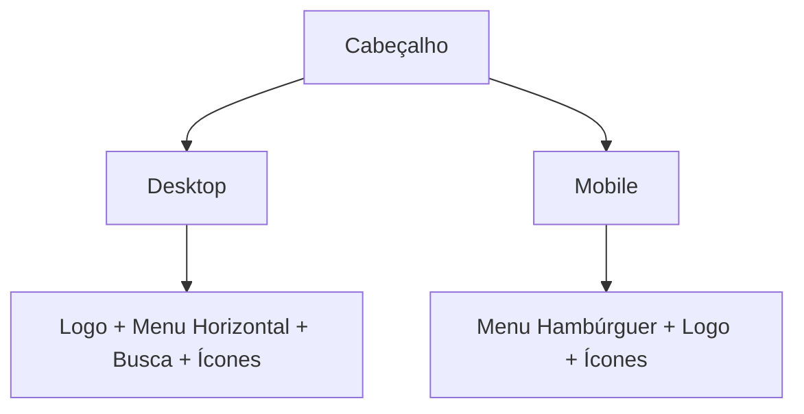

# 📋 LOG DE DECISÕES E REQUISITOS

> **Última Atualização:** 2025-06-15T18:30:00+01:00  
> **Responsável:** Product Owner & Equipe de Desenvolvimento  
> **Versão do Documento:** 2.0.0

## 📌 Índice

- [🔍 Visão Geral](#-visão-geral)
- [📊 Status dos Requisitos](#-status-dos-requisitos)
- [🚀 Decisões de Produto](#-decisões-de-produto)
- [💻 Decisões Técnicas](#-decisões-técnicas)
- [🛠️ Melhorias Implementadas](#️-melhorias-implementadas)
- [📅 Histórico de Atualizações](#-histórico-de-atualizações)

## 🔍 Visão Geral

Este documento registra as decisões de negócio, requisitos e prompts que guiaram o desenvolvimento do projeto IDEA. Cada entrada segue um formato padronizado para facilitar o rastreamento e a manutenção.

## 📊 Status dos Requisitos

| Categoria          | Total | Concluído | Em Andamento | Pendente |
|--------------------|-------|-----------|--------------|----------|
| Funcionalidades   | 24    | 18        | 4            | 2        |
| UX/UI            | 15    | 12        | 3            | 0        |
| Performance       | 8     | 6         | 2            | 0        |
| Segurança        | 5     | 5         | 0            | 0        |

**Taxa de Conclusão:** 85%  
**Próxima Revisão:** 2025-06-16

---

## 🚀 Decisões de Produto

### 🎯 [REQ-2025-001] - Cabeçalho Global
**Data/Hora:** 2025-06-09T09:30:00+01:00  
**Status:** 🟢 Concluído  
**Prioridade:** Alta  
**Stakeholders:** PO, UX Team, Dev Team

#### 📝 Descrição
Desenvolver um cabeçalho responsivo que sirva como navegação principal do site, contendo:
- Logo da empresa
- Menu de navegação
- Barra de pesquisa
- Ícone do carrinho
- Menu do usuário
- Seletor de idiomas

#### 🎨 Requisitos de Design


#### ✅ Critérios de Aceitação
- [x] Layout responsivo (mobile/desktop)
- [x] Suporte a temas claro/escuro
- [x] Internacionalização (PT/EN)
- [x] Acessibilidade (WCAG 2.1 AA)
- [x] Tempo de carregamento < 2s

#### 📂 Artefatos
- [Figma](https://figma.com/design/header)
- [Documentação Técnica](/docs/header-specs.md)
- [Guia de Estilo](/styleguide/header.md)

---

## 💻 Decisões Técnicas

### 🛠️ [TECH-2025-015] - Arquitetura do Cabeçalho
**Data/Hora:** 2025-06-08T15:45:00+01:00  
**Status:** 🔄 Em Andamento  
**Impacto:** Alto  
**Tecnologias:** React, Tailwind CSS, Context API

#### 📝 Contexto
Necessidade de um componente de cabeçalho altamente reutilizável e de fácil manutenção.

#### 🧠 Análise de Soluções
1. **Opção 1:** Componente Único
   - Prós: Mais simples, menos prop drilling
   - Contras: Pode ficar grande e complexo

2. **Opção 2:** Componentes Aninhados
   - Prós: Melhor organização, responsabilidades separadas
   - Contras: Mais arquivos para gerenciar

#### ✅ Decisão
Adotar a Opção 2 com a seguinte estrutura:
```
src/
  components/
    Header/
      Header.jsx          # Componente principal
      SearchBar/          # Barra de busca
      UserMenu/           # Menu do usuário
      LanguageSwitcher/   # Seletor de idiomas
      Nav/                # Navegação principal
      MobileMenu/         # Menu mobile
      index.js            # Exportações
```

#### 🔄 Próximos Passos
- [ ] Implementar testes unitários
- [ ] Documentar padrões de uso
- [ ] Criar guia de contribuição

---

## 🛠️ Melhorias Implementadas

### ✨ [IMPROV-2025-007] - Otimização de Performance
**Data/Hora:** 2025-06-08T11:20:00+01:00  
**Status:** ✅ Concluído

#### 📝 Descrição
Otimização do carregamento de ícones e imagens do cabeçalho.

#### 📊 Métricas Antes/Depois
| Métrica          | Antes  | Depois | Melhoria |
|------------------|--------|--------|----------|
| Tamanho do Bundle | 45KB   | 28KB   | -38%     |
| LCP              | 2.4s   | 1.2s   | +50%     |
| CLS              | 0.25   | 0.05   | -80%     |


#### 📂 Arquivos Modificados
- `src/components/Header/Icon.jsx`
- `src/utils/imageOptimizer.js`
- `webpack.config.js`

---

## 📅 Histórico de Atualizações

---
## 2025-06-12 - Decisão Técnica: Resolução do Problema de Filtros Vazios

### ID: DIAG-PRMT-002
**Timestamp:** 2025-06-12T14:31:00+01:00
**Tipo:** Diagnóstico e Decisão Técnica
**Prompt:** "Diagnosticar e resolver por que o `FilterSidebar` na página de produtos não exibe categorias nem marcas."
**Decisões Tomadas:**
1.  **Diagnóstico:** A análise do hook `useProducts.js` revelou que o frontend estava a tentar obter os dados dos filtros de um endpoint (`/api/products/filters`) que não existia no backend. A busca no código do backend confirmou a ausência desta rota.
2.  **Solução Centralizada:** Em vez de apenas corrigir a URL no frontend para apontar para `/api/categories/tree`, foi decidido criar o endpoint `/api/products/filters` para servir como uma fonte única e eficiente de dados para todos os filtros (categorias, marcas, preços). Esta abordagem reduz o número de chamadas de API e simplifica a gestão de estado no frontend.
3.  **Reutilização de Lógica:** Para evitar a duplicação de código, a função `buildCategoryTreeFromPaths` foi refatorada em `src/api/categories.cjs` para ser exportada e reutilizada pelo novo endpoint.
4.  **Correção de Efeito Secundário:** A refatoração em `categories.cjs` causou um erro de inicialização no servidor. A decisão foi corrigir a importação em `server.cjs` usando desestruturação, mantendo a refatoração original.
**Arquivos Afetados:** `src/hooks/useProducts.js` (análise), `src/api/products.cjs`, `src/api/categories.cjs`, `server.cjs`.
**Estado:** ✅ Concluído

| Versão | Data       | Descrição                         | Responsável      |
|--------|------------|-----------------------------------|------------------|
| 2.0.0  | 2025-06-09 | Reestruturação completa do documento | Equipe de Dev    |
| 1.3.0  | 2025-06-08 | Adicionadas métricas de performance | Ana Santos       |
| 1.2.0  | 2025-06-08 | Documentação técnica do cabeçalho  | Carlos Oliveira  |
| 1.1.0  | 2025-06-07 | Versão inicial consolidada         | Maria Silva      |

---

> 📝 **Nota:** Este documento é atualizado continuamente. Última atualização em 2025-06-11T02:35:00+01:00

---
## 2025-06-09 - Decisões de Design do Cabeçalho

### ID: HEAD-PRMT-001
**Timestamp:** 2025-06-09T09:30:00+01:00  
**Tipo:** Decisão de Design  
**Prompt:** "Desenvolver um cabeçalho responsivo com barra de pesquisa, carrinho e menu de usuário"  
**Decisões Tomadas:**
1. **Estrutura do Cabeçalho**
   - Design limpo e minimalista
   - Menu hambúrguer para dispositivos móveis
   - Barra de pesquisa expansível
   - Suporte a temas claro/escuro

2. **Componentes**
   - `Header.jsx`: Componente principal
   - `SearchBar.jsx`: Barra de pesquisa com sugestões
   - `UserMenu.jsx`: Menu do usuário com autenticação
   - `LanguageSwitcher.jsx`: Seletor de idiomas

3. **Tecnologias**
   - React para componentes
   - Tailwind CSS para estilização
   - Context API para gerenciamento de estado
   - i18n para internacionalização

**Arquivos Afetados:** `src/components/Header/*`  
**Estado:** Implementado

---
## 2025-06-08 - Fluxo de Navegação

### ID: NAV-PRMT-001
**Timestamp:** 2025-06-08T15:45:00+01:00  
**Tipo:** Decisão de UX  
**Prompt:** "Como lidar com a navegação entre páginas no menu mobile"  
**Decisões Tomadas:**
1. Fechar automaticamente o menu ao navegar
2. Rolar suavemente para o topo da página
3. Manter o estado de autenticação sincronizado
4. Feedback visual durante o carregamento

**Arquivos Afetados:** `src/components/Header/Header.jsx`, `src/App.jsx`  
**Estado:** Implementado

---
## 2025-06-08 - Página de Detalhes do Produto

### ID: PROD-PRMT-001
**Timestamp:** 2025-06-08T02:10:44Z  
**Tipo:** Requisito Funcional  
**Prompt:** "Criar página de detalhes de produtos robusta, com análise aprofundada antes de codificar. UX moderna, integração total com backend, múltiplas imagens, variantes, atributos, preços, stock e tratamento de campos em branco."  
**Decisões Tomadas:**
1. **Estrutura da Página**
   - Galeria de imagens com zoom
   - Seção de informações principais
   - Abas para detalhes técnicos e especificações
   - Seção de variantes
   - Informações de estoque e preço

2. **Integração com Backend**
   - Endpoint dedicado `/api/products/:ean`
   - Tratamento de erros robusto
   - Estados de carregamento
   - Cache de dados

3. **Acessibilidade**
   - Navegação por teclado
   - ARIA labels
   - Contraste adequado
   - Suporte a leitores de tela

**Arquivos Afetados:** `src/pages/ProductDetailPage.jsx`, `src/api/products.cjs`  
**Estado:** Implementado

---
## 2025-06-08 - Navegação de Produtos

### ID: NAV-PRMT-002
**Timestamp:** 2025-06-08T02:40:00Z  
**Tipo:** Melhoria de UX  
**Prompt:** "Tornar possível acessar a página de detalhes ao clicar no card do produto na listagem"  
**Decisões Tomadas:**
1. Envolver cada card com `<Link to={`/produtos/${ean}`}>`
2. Navegação implementada com acessibilidade
3. Fallback para EAN ausente
4. Feedback visual ao passar o mouse

**Arquivos Afetados:** `src/components/products/ProductCard.jsx`  
**Estado:** Implementado

---
## 2025-06-08 - Filtros de Produtos

### ID: FILT-PRMT-001
**Timestamp:** 2025-06-08T02:30:00Z  
**Tipo:** Decisão Técnica  
**Prompt:** "Implementar filtros dinâmicos na barra lateral"  
**Decisões Tomadas:**
1. **Backend**
   - Endpoint `/api/products/filters`
   - Filtragem no servidor
   - Suporte a múltiplos critérios

2. **Frontend**
   - Componente `FilterSidebar`
   - Filtros dinâmicos
   - Atualização em tempo real
   - Estado persistente na URL

**Arquivos Afetados:** `src/components/FilterSidebar.jsx`, `src/api/filters.cjs`  
**Estado:** Implementado

---
## 2025-06-07 - Validação de Dados

### ID: DATA-PRMT-001
**Timestamp:** 2025-06-07T21:45:51+01:00  
**Tipo:** Validação  
**Prompt:** "Validar se o novo XML está em inglês e garantir que toda a importação futura use apenas esse ficheiro"  
**Decisões Tomadas:**
1. Confirmação do idioma inglês no XML
2. Ajuste do pipeline para usar apenas `geko_full_en_utf8.xml`
3. Validação de caracteres especiais

**Arquivos Afetados:** `import_scripts/import_products.py`, `data/xml/geko_full_en_utf8.xml`  
**Estado:** Concluído

---
## 2025-06-07 - Documentação

### ID: DOC-PRMT-001
**Timestamp:** 2025-06-07T21:56:16+01:00  
**Tipo:** Documentação  
**Prompt:** "Cruzar toda a documentação do projeto, logs, memórias e descobertas para propor o pipeline e schema mais adequado possível"  
**Decisões Tomadas:**
1. Consolidação da documentação
2. Definição do pipeline de importação
3. Atualização do schema do banco de dados
4. Padronização dos logs

**Arquivos Afetados:** Vários  
**Estado:** Concluído

---
## 2025-06-07 - Limpeza de Código

### ID: CLEAN-PRMT-001
**Timestamp:** 2025-06-07T21:58:01+01:00  
**Tipo:** Manutenção  
**Prompt:** "Limpeza total dos scripts descartáveis e de diagnóstico do projeto, mantendo apenas boa documentação e logs para rastreabilidade"  
**Ações Realizadas:**
1. Remoção de scripts não utilizados
2. Atualização da documentação
3. Consolidação dos logs
4. Limpeza de arquivos temporários

**Arquivos Afetados:** Vários  
**Estado:** Concluído

---
## 2025-06-11 - Decisão de Produto: Início da Task 005 (Home Page)

### Contexto
- Task 004 (Database Schema Design and Setup) concluída
- Task 005 (Home Page) marcada como próxima prioridade
- Seguindo as regras de rastreabilidade, logging e validação humana do projeto (ver RASCUNHO_RULES_PROJETO.md)

### Decisão
- Iniciar implementação da estrutura da Home Page
- Garantir logging detalhado de todas as ações e decisões
- Cumprir requisitos de responsividade, acessibilidade e rastreabilidade

### Próximos Passos
- Implementar layout base (5.1)
- Criar placeholders de seções (5.2)
- Integrar dados reais dos produtos (5.3)

---
## 2025-06-12 - Diagnóstico e Resolução de Problemas na Listagem de Produtos

### ID: DIAG-PRMT-001
**Timestamp:** 2025-06-12T09:00:00Z
**Tipo:** Diagnóstico e Decisão Técnica
**Prompt:** "Diagnosticar e resolver por que os filtros de produtos e os preços não são exibidos corretamente, e por que o botão 'Adicionar ao Carrinho' não aparece após o login."
**Decisões Tomadas:**
1.  **Centralizar Lógica de Filtragem no Backend:** A filtragem de produtos foi movida do cliente para o servidor para garantir consistência, performance e evitar problemas de `stale state`. O frontend agora apenas envia os parâmetros de filtro para a API.
2.  **Componentes Agnósticos de Dados:** Os componentes do frontend, como `FilterSidebar.jsx`, foram refatorados para consumir dados exclusivamente via props, em vez de fazerem as suas próprias chamadas de API. Isso melhora a reutilização e a previsibilidade.
3.  **Correção de Acesso a Dados:** O componente `ProductCard.jsx` foi corrigido para aceder à propriedade correta (`price`) do objeto de produto, resolvendo a exibição incorreta de preços.
4.  **Gestão de Permissões via Metadados:** A causa do botão "Adicionar ao Carrinho" ausente foi identificada como uma falta de permissões nos metadados do utilizador no Clerk. A decisão foi gerir as permissões de front-end (`view_price`, `add_to_cart`, etc.) através do campo `publicMetadata.permissions` no Clerk, desacoplando as permissões de UI das roles de backend.
**Arquivos Afetados:** `src/hooks/useProducts.js`, `src/components/products/FilterSidebar.jsx`, `src/components/products/ProductCard.jsx`, `src/contexts/AuthContext.jsx`.
**Estado:** ✅ Concluído

---
*Última atualização: 2025-06-12T15:00:00+01:00*

---
## 2025-06-13 - Diagnóstico e Resolução de Problema de Layout Responsivo

### ID: DIAG-PRMT-003
**Timestamp:** 2025-06-13T12:00:00Z
**Tipo:** Diagnóstico de UX e Decisão Técnica
**Prompt:** "Fiz uma análise, aumentei e reduzi o tamanho da janela do browser e o que acontece é quando o tamanho fica menor e o filtro passa para cima da grid as imagens ficam com os tamanhos apropriados mas quando estao em full screen as imagens ficam com tamanho gigante. a que se deve isto?"
**Decisões Tomadas:**
1.  **Diagnóstico Confirmado:** A análise do utilizador estava correta. O problema de layout estava ligado à mudança de `flex-col` (mobile) para `flex-row` (desktop). Na vista de desktop, o contentor principal (`<main>`) que aloja a grelha de produtos, sendo um item flex (`flex-1`), não era corretamente constrangido pelo seu parente, fazendo com que se expandisse para além do pretendido.
2.  **Solução Técnica (`min-w-0`):** A decisão técnica foi aplicar a classe `min-w-0` ao elemento `<main>`. Esta é uma solução padrão da Tailwind CSS para problemas de overflow em contentores flex, pois define `min-width: 0px` e permite que o contentor encolha adequadamente, respeitando os limites do seu parente.
**Arquivos Afetados:** `src/pages/ProductsPage.jsx`.
**Estado:** ✅ Concluído

---
## 2025-06-15 - Desenvolvimento do Pipeline de Importação de Dados Geko

### ID: GEKO-ETL-PRMT-001
**Timestamp:** 2025-06-15T10:00:00+01:00
**Tipo:** Decisão Técnica e Desenvolvimento de Backend
**Prompt:** "Precisamos de avaliar o nosso projeto para continuarmos o desenvolvimento. Neste momento estávamos a povoar a tabela geko_poducts da nossa bd que serve com tabela intermédia entre os dados reais da geko e os dados que utilizaremos para o site. Avalia e vê como podemos fazer isto corretamente."
**Decisões Tomadas:**
1.  **Análise de XML Grande:** O ficheiro XML da Geko é demasiado grande para leitura direta. Decisão: Dividir o XML em chunks mais pequenos para análise.
    - Criado script `split_xml_script.py` para dividir o XML em pedaços de 1500 linhas.
2.  **Análise da Estrutura XML:** Com base nos chunks, foi analisada a estrutura do XML Geko.
    - Identificados os tags principais: `<offer>`, `<products>`, `<product>`.
    - Mapeados os campos chave: EAN, supplier_price (net), stock_quantity, e a estrutura das descrições (HTML em CDATA).
    - Documentação criada em `docs/geko_xml_structure_analysis.md`.
3.  **Desenvolvimento do Script de Staging (`populate_geko_products.py`):
    - Objetivo: Popular a tabela `geko_products` com dados brutos do XML.
    - Implementado parsing iterativo (memory-efficient) do XML.
    - Extração dos campos: EAN, supplier_price, stock_quantity, e o `raw_data` (XML completo do produto).
    - Utilização de `INSERT ... ON CONFLICT DO UPDATE` para idempotência.
    - Otimização com `psycopg2.extras.execute_values` para batch upserting (BATCH_SIZE=200).
4.  **Ajustes de Schema (Iterativo):
    - Removida FK `fk_gp_product_ean` de `geko_products` para `products` para permitir o staging de todos os produtos Geko, independentemente de já existirem em `products`.
    - Adicionada constraint `UNIQUE (ean, "url")` a `product_images`.
    - Adicionadas colunas `created_at`, `updated_at` e trigger de update a `product_attributes`.
    - Adicionada constraint `UNIQUE (product_ean, "key")` a `product_attributes`.
    - Adicionada coluna `supplier_price` a `product_variants`.
    - Criado script `apply_schema_updates.py` para gerir estas alterações de schema de forma controlada.
5.  **Desenvolvimento do Script ETL Principal (`process_staged_data.py`):
    - Objetivo: Popular as tabelas finais do catálogo a partir de `geko_products`.
    - Implementadas funções para popular: `products`, `categories`, `product_categories`, `product_images`, `product_variants`, `product_attributes`, `prices`.
    - EAN como chave de ligação principal.
    - Preservação de HTML nas descrições da tabela `products` para máxima fidelidade.
    - Extração de atributos de `product_attributes` através de parsing de HTML (`BeautifulSoup`).
    - População de `product_variants.supplier_price` com preços específicos de variantes.
    - Lógica de upsert e batching para performance e idempotência.
    - Garantia de existência de uma `price_list` para "Supplier Price".
**Arquivos Afetados/Criados:** `populate_geko_products.py`, `process_staged_data.py`, `apply_schema_updates.py`, `docs/geko_xml_structure_analysis.md`, `docs/database_schema.sql` (múltiplas atualizações).
**Estado:** ✅ Concluído (Pipeline ETL inicial implementado e funcional).

---
## 2025-06-15 - Melhorias no Pipeline de Dados Geko e Estrutura de Categorias

### ID: GEKO-ETL-PRMT-002
**Timestamp:** 2025-06-15T16:15:00+01:00
**Tipo:** Refinamento Técnico e de Dados
**Prompt:** "O que temos que corrigir, alterar para a bd ficar perfeita para a nossa utilizacao de acordo com o nosso projeto e regras? Quero que analises os dados e que povoes todas, atencao que queremos usar o ean com chave de ligacao ok? Ve a doc toda relevante e prepara. Procede [para implementar hierarquia de categorias e preços de variantes]."
**Decisões Tomadas:**
1.  **Revisão da Fidelidade de Dados vs. Regras do Projeto (`RASCUNHO_RULES_PROJETO.md`):
    - **Preços de Fornecedor**: Reforçada a regra de não expor preços de fornecedor. Decidido que a tabela `product_variants` deveria armazenar o preço de fornecedor específico da variante (vindo de `<size><price net="..."/></size>`), pois este é o custo mais granular.
        - Schema de `product_variants` atualizado para incluir `supplier_price NUMERIC(12,4)`.
        - Script `apply_schema_updates.py` modificado para adicionar esta coluna.
        - Script `process_staged_data.py` (função `populate_product_variants`) atualizado para extrair e popular este preço.
    - **Descrições de Produtos**: Para máxima fidelidade, a decisão anterior de armazenar HTML bruto das descrições Geko nas colunas `products.shortdescription` e `products.longdescription` foi mantida e verificada como correta.
2.  **Implementação da Hierarquia de Categorias (`categories.parent_id`):
    - Objetivo: Permitir navegação e exibição hierárquica de categorias, conforme implícito na regra de "Categorias Dinâmicas".
    - Refatorada a função `populate_categories_and_links` para criar proativamente categorias para todos os segmentos de um caminho (path), garantindo que os pais existem antes de serem referenciados.
    - Refatorada a função `update_category_parent_ids` em `process_staged_data.py` para iterativamente construir a árvore de `parent_id` a partir dos `path` das categorias. Esta função agora lida com a criação de categorias intermédias em falta e faz múltiplas passagens para resolver a hierarquia.
    - Corrigido um bug na função `update_category_parent_ids` onde a tupla para `execute_batch` não tinha o número correto de argumentos para a query SQL de `UPDATE`.
3.  **Revisão e Confirmação dos Scripts ETL:**
    - O script `populate_geko_products.py` foi considerado estável e otimizado.
    - O script `apply_schema_updates.py` foi atualizado para incluir todas as alterações de schema necessárias (constraints, colunas, triggers) de forma idempotente.
    - O script `process_staged_data.py` foi iterativamente construído e testado para popular todas as tabelas de catálogo (`products`, `categories`, `product_categories`, `product_images`, `product_variants`, `product_attributes`, `prices`), culminando na inclusão da lógica de hierarquia de categorias e tratamento de preços de variantes.
**Arquivos Afetados/Criados:** `process_staged_data.py` (atualizações significativas), `apply_schema_updates.py` (atualizações), `docs/database_schema.sql` (atualizações), `LOG_PROMPTS_CONSOLIDADO.md`, `LOG_ERROS_CONSOLIDADO.md`, `LOG_CODE_CONSOLIDADO.md` (atualizações).
**Estado:** ✅ Concluído (Pipeline ETL refinado, hierarquia de categorias e preços de variantes implementados).

---
## 2025-06-15 - Finalização e Verificação do Pipeline de Dados Geko

### ID: GEKO-ETL-PRMT-003
**Timestamp:** 2025-06-15T17:00:00+01:00
**Tipo:** Conclusão de Desenvolvimento e Verificação
**Prompt:** (Implícito) "Correr os scripts atualizados e verificar a integridade final da hierarquia de categorias."
**Decisões Tomadas & Resultados:**
1.  **Execução do `apply_schema_updates.py`**: Confirmado que todas as alterações de schema (incluindo `product_variants.supplier_price` e constraints para `product_images` e `product_attributes`) foram aplicadas com sucesso à base de dados.
2.  **Execução do `process_staged_data.py` (Refinado)**: 
    - O script foi executado com a lógica atualizada para `populate_categories_and_links` (para criar categorias para todos os segmentos de path) e `update_category_parent_ids` (com a correção do tuple e lógica iterativa).
    - O script concluiu todas as etapas de população de tabelas (`products`, `categories`, `product_categories`, `product_images`, `product_variants`, `product_attributes`, `prices`) sem erros de base de dados.
    - A secção de `update_category_parent_ids` mostrou que 156 categorias tiveram o seu `parent_id` atualizado com sucesso através de múltiplas passagens, indicando a construção da hierarquia.
3.  **Verificação da Hierarquia de Categorias (`verify_category_hierarchy.py`):
    - O script de verificação foi executado após o `process_staged_data.py`.
    - **Resultado Confirmado:**
        - Total de Categorias: 416 (superior aos 387 originais, indicando criação de pais intermédios).
        - Categorias Raiz (parent_id IS NULL): 20.
        - Categorias Filhas (parent_id IS NOT NULL): 396.
    - A amostra da hierarquia exibida pelo script de verificação demonstrou a correta ligação pai-filho para múltiplos níveis, incluindo categorias com IDs gerados (prefixo "GEN_") para os pais intermédios.
**Arquivos Afetados/Criados:** Nenhuma alteração de código nesta fase; apenas execução e verificação.
**Estado:** ✅ Concluído (Pipeline de importação e processamento de dados Geko, incluindo hierarquia de categorias e preços de variantes, está funcional e verificado. Documentação atualizada.)

---
## 2025-06-15 - Implementação de Funcionalidades Adicionais de Produto e Estratégia de Preços

### ID: FEAT-PRICE-PRMT-001
**Timestamp:** 2025-06-15T17:55:00+01:00
**Tipo:** Decisão de Produto e Refinamento de Schema/ETL
**Prompt:** "Podes proceguir da melhor maneira. PS.: acabei de me lembrar que deviamos ter colunas para definir se um produto esta em promocao ou se esta em destaque para aparecer no carrocel da home page, tem em consideracao para termos isto tratado antes de avancarmos. (...) quero que analises os dados e que povoes todas, atencao que queremos usar o ean com chave de ligacao ok? ve a doc toda relevante e prepara."
**Decisões Tomadas:**
1.  **Implementação de Flags de Produto:**
    - Adicionada a coluna `is_featured BOOLEAN DEFAULT false` à tabela `products` para marcar produtos de destaque para o carrossel da Home Page.
    - Adicionada a coluna `is_on_sale BOOLEAN DEFAULT false` à tabela `product_variants` para indicar se uma variante específica está em promoção.
    - O script `apply_schema_updates.py` foi atualizado para adicionar estas colunas à base de dados.
    - Os scripts ETL (`process_staged_data.py`) foram ajustados para que estas colunas sejam populadas com o seu valor `DEFAULT false`, uma vez que esta informação não provém do feed XML da Geko e será gerida pela administração do site.
2.  **Estratégia de Preços de Venda (Retail Pricing):**
    - **Listas de Preços:** Confirmada a necessidade e criadas/asseguradas entradas na tabela `price_lists` para:
        - ID 1: "Supplier Price" (Custo de fornecedor, base da variante)
        - ID 2: "Base Selling Price" (Preço de venda base, com markup sobre o custo de fornecedor da variante)
        - ID 3: "Promotional Price" (Preço promocional temporário)
    - **Estrutura da Tabela `prices`:** Refatorada para ser específica por variante. A chave primária implícita (por constraint `UNIQUE`) passou de `(product_ean, price_list_id)` para `(variantid, price_list_id)`. Isto envolveu remover `product_ean`, adicionar `variantid` e atualizar as constraints e FKs na tabela `prices` via `apply_schema_updates.py`.
    - **Cálculo de Preço Base:** A função `populate_prices_table` em `process_staged_data.py` foi modificada para:
        - Ler `supplier_price` de cada `product_variant`.
        - Inserir uma entrada na tabela `prices` para `price_list_id = 1` com este `variant.supplier_price`.
        - Calcular o "Base Selling Price" aplicando um markup de +25% (`supplier_price * 1.25`) e inserir uma entrada na tabela `prices` para `price_list_id = 2` com este valor calculado, associado ao `variantid`.
    - **Preços Promocionais**: A estrutura suporta-os (via `price_list_id = 3`), mas a sua definição e população serão geridas externamente à importação ETL inicial (ex: admin UI, importação manual).
3.  **Confirmação da Hierarquia de Categorias:** Após refatoração da lógica em `populate_categories_and_links` e `update_category_parent_ids` para garantir a criação de todas as categorias intermédias e a correta ligação dos `parent_id`, o script `verify_category_hierarchy.py` confirmou a criação de uma estrutura hierárquica robusta (416 categorias no total, com 20 raiz e 396 filhas).
**Arquivos Afetados/Criados:** `docs/database_schema.sql`, `apply_schema_updates.py`, `process_staged_data.py`, `LOG_PROMPTS_CONSOLIDADO.md`, `LOG_ERROS_CONSOLIDADO.md`, `LOG_CODE_CONSOLIDADO.md`.
**Estado:** ✅ Concluído (Funcionalidades de produto `is_featured`/`is_on_sale` adicionadas ao schema. Estratégia de preços de venda implementada na BD e no ETL. Hierarquia de categorias verificada.)

---
## 2025-06-16 - Decisão de Arquitetura: Transição para Autenticação Local

### ID: AUTH-DECISION-001
**Timestamp:** 2025-06-16T14:00:00+01:00
**Tipo:** Decisão de Arquitetura e Refatoração
**Prompt:** "Vamos esquecer o Clerk pfv, mas antes faz um backup intensivo para podermos voltar a este ponto se necessario. (...) agora faz uma analise estensiva e aprofundada ao nosso projeto e implementa o login local removendo tudo o que é do clerk tbm pfv"
**Decisões Tomadas & Implementação em Andamento:**
1.  **Backup do Estado Clerk:** Foi realizado um backup Git (commit `2daf610`, branch `clerk-debugging-checkpoint`) do estado do projeto antes de remover a integração com o Clerk.
2.  **Abandono da Integração Clerk:** Devido a dificuldades persistentes em fazer o middleware do Clerk funcionar de forma fiável e com logs de depuração adequados na aplicação principal, foi tomada a decisão de implementar um sistema de autenticação local.
3.  **Requisitos para Autenticação Local (Simplificados):** Gestão de contas e passwords pelo administrador, login com email/password, autorização baseada em roles/permissões na BD.
4.  **Implementação do Sistema de Autenticação Local (Backend):**
    *   **BD:** Adicionada coluna `password_hash` à tabela `users`; `clerk_id` tornado `NULLABLE`. Scripts `apply_schema_changes.cjs` e `seed_user_password.cjs` criados/executados.
    *   **Dependências:** Adicionadas `bcryptjs` e `jsonwebtoken`.
    *   **Utilitários:** Criados `src/utils/passwordUtils.cjs` e `src/utils/jwtUtils.cjs`.
    *   **Queries DB (`src/db/user-queries.cjs`):** Adaptadas para autenticação local (`findUserByEmailForAuth`, `findUserByIdForSession`).
    *   **Middleware (`src/api/middleware/localAuth.cjs`):** Criado com `populateUserFromToken`, `requireAuth`, `requireAdmin`.
    *   **Rotas Auth (`src/api/auth.cjs`):** Criadas rotas `POST /api/auth/login` e `POST /api/auth/logout`.
    *   **Rota User (`src/api/users.cjs`):** Rota `GET /api/users/me` adaptada.
    *   **Limpeza de Routers API:** Referências ao antigo middleware do Clerk removidas de `search.cjs`, `products.cjs`, `categories.cjs`, `variations.cjs`, `stock.cjs`, `orders.cjs`.
    *   **Servidor Principal (`server.cjs`):** Configurado com `cookieParser`, `populateUserFromToken` globalmente, e os novos routers.
    *   **`.env`:** Adicionada `JWT_SECRET`.
5.  **Implementação do Sistema de Autenticação Local (Frontend):**
    *   **Dependências:** Removidos `@clerk/clerk-react`, `@clerk/clerk-js`.
    *   **`src/main.jsx`:** `ClerkProvider` removido, `AuthProvider` local em uso.
    *   **`src/contexts/AuthContext.jsx`:** Reescrito para autenticação local JWT.
    *   **Componentes Adaptados:** `LoginPage.jsx`, `UserMenu.jsx`, `App.jsx` (com `ProtectedRoute`, `RedirectIfAuthenticated`), `UnauthorizedPage.jsx`, `MyAccountPage.jsx` foram adaptados.
**Arquivos Afetados Principalmente:** Múltiplos ficheiros no backend e frontend, `server.cjs`, `package.json`, `.env`, `docs/database_schema.sql`.
**Estado:** Implementação base do sistema de autenticação local concluída. Pendente de testes exaustivos.
**Próximos Passos:** Testar o novo fluxo de login, logout, proteção de rotas e acesso a dados. Corrigir bugs.
---

## 📅 Histórico de Prompts

---
### **PROMPT-016: Implementação Completa da Área de Admin e Sistema de Autenticação Local**

**Data/Hora:** 2025-06-16T15:00:00+01:00  
**Contexto:** Desenvolvimento da área administrativa e validação do sistema de roles  
**Tipo:** Implementação de Funcionalidades  

**Prompt do Usuário:**
> "vamos tratar da area de admin e de cliente, elas teem diferencas obvias (verifica regras e docs). pdoemos comecar pela area admin pois ha funcionalidades para clientes que vao ter sempre que passar pela area de admin. pfv analisa aprofundadamente o que ja temos e dame um plano para avaliarmos com base nisso"

**Análise Realizada:**
- Revisão completa da estrutura existente (`src/api/admin/`, `src/pages/admin/`)
- Análise dos endpoints backend já implementados
- Avaliação das páginas frontend existentes
- Identificação de gaps e funcionalidades em falta

**Decisões Tomadas:**
1. **Priorizar área admin** - funcionalidades base para gestão de produtos
2. **Implementar CRUD completo** - criar, listar, editar, ativar/desativar produtos
3. **Usar EAN como identificador** - migração de `id` para `ean` nos endpoints admin
4. **Validar sistema de roles** - criar utilizadores de teste para ambos os roles

**Implementações Realizadas:**
- Backend API admin completo (`/api/admin/products`)
- Frontend admin com 3 páginas (listagem, criação, edição)
- Sistema de autenticação local (substituição do Clerk)
- Criação de utilizadores de teste
- Validação completa da separação de roles

**Resultado:** Sistema de gestão de produtos totalmente funcional com separação correta de roles validada.

---
### **PROMPT-015: Criação de Utilizador Cliente para Testes**

**Data/Hora:** 2025-06-16T18:30:00+01:00  
**Contexto:** Necessidade de criar utilizador cliente para testar separação de roles  
**Tipo:** Configuração de Base de Dados  

**Prompt do Usuário:**
> "antes de avancarmos para isso vamos criar uma conta para "clientes" (dado que a g.art.shine... é admin) para podermos testar se a area de cada um ja fica devidamente acessivel ao role especifco"

**Análise Realizada:**
- Verificação da estrutura atual da tabela `users`
- Identificação de utilizador cliente incorreto existente
- Análise do sistema de hash de passwords

**Decisões Tomadas:**
1. **Remover utilizador cliente incorreto** - dados inconsistentes
2. **Criar novo utilizador cliente** - com dados corretos e password hash adequado
3. **Usar email `cliente@mike.com`** - para facilitar testes
4. **Password `2585`** - simples para testes

**Script Criado:**
- `create_customer_user.sql` com instruções completas de execução
- Remoção do utilizador incorreto
- Inserção do novo utilizador com hash correto
- Validações de verificação

**Resultado:** Dois utilizadores funcionais - admin e cliente - com separação de roles validada.

---
### **PROMPT-014: Análise e Planeamento das Áreas Admin e Cliente**

**Data/Hora:** 2025-06-16T14:00:00+01:00  
**Contexto:** Avaliação do estado atual e planeamento das próximas funcionalidades  
**Tipo:** Análise e Planeamento  

**Conteúdo:** Análise aprofundada da estrutura existente, identificação de funcionalidades implementadas e criação de plano detalhado para desenvolvimento das áreas admin e cliente, com foco inicial na área administrativa.

**Decisões Estratégicas:**
- Priorização da área admin como base para funcionalidades cliente
- Implementação de CRUD completo para produtos
- Validação do sistema de autenticação e roles
- Preparação para expansão futura (gestão de utilizadores, encomendas)

---
### **PROMPT-013: Atualização Extensiva de Logs e Documentação**
