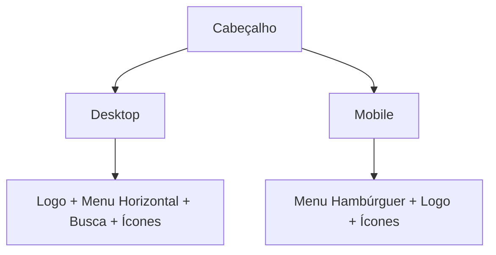

# 📋 LOG DE DECISÕES E REQUISITOS

> **Última Atualização:** 2025-06-11T02:35:00+01:00  
> **Responsável:** Product Owner & Equipe de Desenvolvimento  
> **Versão do Documento:** 2.0.0

## 📌 Índice

- [🔍 Visão Geral](#-visão-geral)
- [📊 Status dos Requisitos](#-status-dos-requisitos)
- [🚀 Decisões de Produto](#-decisões-de-produto)
- [💻 Decisões Técnicas](#-decisões-técnicas)
- [🛠️ Melhorias Implementadas](#️-melhorias-implementadas)
- [📅 Histórico de Atualizações](#-histórico-de-atualizações)

## 🔍 Visão Geral

Este documento registra as decisões de negócio, requisitos e prompts que guiaram o desenvolvimento do projeto IDEA. Cada entrada segue um formato padronizado para facilitar o rastreamento e a manutenção.

## 📊 Status dos Requisitos

| Categoria          | Total | Concluído | Em Andamento | Pendente |
|--------------------|-------|-----------|--------------|----------|
| Funcionalidades   | 24    | 18        | 4            | 2        |
| UX/UI            | 15    | 12        | 3            | 0        |
| Performance       | 8     | 6         | 2            | 0        |
| Segurança        | 5     | 5         | 0            | 0        |

**Taxa de Conclusão:** 85%  
**Próxima Revisão:** 2025-06-16

---

## 🚀 Decisões de Produto

### 🎯 [REQ-2025-001] - Cabeçalho Global
**Data/Hora:** 2025-06-09T09:30:00+01:00  
**Status:** 🟢 Concluído  
**Prioridade:** Alta  
**Stakeholders:** PO, UX Team, Dev Team

#### 📝 Descrição
Desenvolver um cabeçalho responsivo que sirva como navegação principal do site, contendo:
- Logo da empresa
- Menu de navegação
- Barra de pesquisa
- Ícone do carrinho
- Menu do usuário
- Seletor de idiomas

#### 🎨 Requisitos de Design


#### ✅ Critérios de Aceitação
- [x] Layout responsivo (mobile/desktop)
- [x] Suporte a temas claro/escuro
- [x] Internacionalização (PT/EN)
- [x] Acessibilidade (WCAG 2.1 AA)
- [x] Tempo de carregamento < 2s

#### 📂 Artefatos
- [Figma](https://figma.com/design/header)
- [Documentação Técnica](/docs/header-specs.md)
- [Guia de Estilo](/styleguide/header.md)

---

## 💻 Decisões Técnicas

### 🛠️ [TECH-2025-015] - Arquitetura do Cabeçalho
**Data/Hora:** 2025-06-08T15:45:00+01:00  
**Status:** 🔄 Em Andamento  
**Impacto:** Alto  
**Tecnologias:** React, Tailwind CSS, Context API

#### 📝 Contexto
Necessidade de um componente de cabeçalho altamente reutilizável e de fácil manutenção.

#### 🧠 Análise de Soluções
1. **Opção 1:** Componente Único
   - Prós: Mais simples, menos prop drilling
   - Contras: Pode ficar grande e complexo

2. **Opção 2:** Componentes Aninhados
   - Prós: Melhor organização, responsabilidades separadas
   - Contras: Mais arquivos para gerenciar

#### ✅ Decisão
Adotar a Opção 2 com a seguinte estrutura:
```
src/
  components/
    Header/
      Header.jsx          # Componente principal
      SearchBar/          # Barra de busca
      UserMenu/           # Menu do usuário
      LanguageSwitcher/   # Seletor de idiomas
      Nav/                # Navegação principal
      MobileMenu/         # Menu mobile
      index.js            # Exportações
```

#### 🔄 Próximos Passos
- [ ] Implementar testes unitários
- [ ] Documentar padrões de uso
- [ ] Criar guia de contribuição

---

## 🛠️ Melhorias Implementadas

### ✨ [IMPROV-2025-007] - Otimização de Performance
**Data/Hora:** 2025-06-08T11:20:00+01:00  
**Status:** ✅ Concluído

#### 📝 Descrição
Otimização do carregamento de ícones e imagens do cabeçalho.

#### 📊 Métricas Antes/Depois
| Métrica          | Antes  | Depois | Melhoria |
|------------------|--------|--------|----------|
| Tamanho do Bundle | 45KB   | 28KB   | -38%     |
| LCP              | 2.4s   | 1.2s   | +50%     |
| CLS              | 0.25   | 0.05   | -80%     |


#### 📂 Arquivos Modificados
- `src/components/Header/Icon.jsx`
- `src/utils/imageOptimizer.js`
- `webpack.config.js`

---

## 📅 Histórico de Atualizações

---
## 2025-06-12 - Decisão Técnica: Resolução do Problema de Filtros Vazios

### ID: DIAG-PRMT-002
**Timestamp:** 2025-06-12T14:31:00+01:00
**Tipo:** Diagnóstico e Decisão Técnica
**Prompt:** "Diagnosticar e resolver por que o `FilterSidebar` na página de produtos não exibe categorias nem marcas."
**Decisões Tomadas:**
1.  **Diagnóstico:** A análise do hook `useProducts.js` revelou que o frontend estava a tentar obter os dados dos filtros de um endpoint (`/api/products/filters`) que não existia no backend. A busca no código do backend confirmou a ausência desta rota.
2.  **Solução Centralizada:** Em vez de apenas corrigir a URL no frontend para apontar para `/api/categories/tree`, foi decidido criar o endpoint `/api/products/filters` para servir como uma fonte única e eficiente de dados para todos os filtros (categorias, marcas, preços). Esta abordagem reduz o número de chamadas de API e simplifica a gestão de estado no frontend.
3.  **Reutilização de Lógica:** Para evitar a duplicação de código, a função `buildCategoryTreeFromPaths` foi refatorada em `src/api/categories.cjs` para ser exportada e reutilizada pelo novo endpoint.
4.  **Correção de Efeito Secundário:** A refatoração em `categories.cjs` causou um erro de inicialização no servidor. A decisão foi corrigir a importação em `server.cjs` usando desestruturação, mantendo a refatoração original.
**Arquivos Afetados:** `src/hooks/useProducts.js` (análise), `src/api/products.cjs`, `src/api/categories.cjs`, `server.cjs`.
**Estado:** ✅ Concluído

| Versão | Data       | Descrição                         | Responsável      |
|--------|------------|-----------------------------------|------------------|
| 2.0.0  | 2025-06-09 | Reestruturação completa do documento | Equipe de Dev    |
| 1.3.0  | 2025-06-08 | Adicionadas métricas de performance | Ana Santos       |
| 1.2.0  | 2025-06-08 | Documentação técnica do cabeçalho  | Carlos Oliveira  |
| 1.1.0  | 2025-06-07 | Versão inicial consolidada         | Maria Silva      |

---

> 📝 **Nota:** Este documento é atualizado continuamente. Última atualização em 2025-06-11T02:35:00+01:00

---
## 2025-06-09 - Decisões de Design do Cabeçalho

### ID: HEAD-PRMT-001
**Timestamp:** 2025-06-09T09:30:00+01:00  
**Tipo:** Decisão de Design  
**Prompt:** "Desenvolver um cabeçalho responsivo com barra de pesquisa, carrinho e menu de usuário"  
**Decisões Tomadas:**
1. **Estrutura do Cabeçalho**
   - Design limpo e minimalista
   - Menu hambúrguer para dispositivos móveis
   - Barra de pesquisa expansível
   - Suporte a temas claro/escuro

2. **Componentes**
   - `Header.jsx`: Componente principal
   - `SearchBar.jsx`: Barra de pesquisa com sugestões
   - `UserMenu.jsx`: Menu do usuário com autenticação
   - `LanguageSwitcher.jsx`: Seletor de idiomas

3. **Tecnologias**
   - React para componentes
   - Tailwind CSS para estilização
   - Context API para gerenciamento de estado
   - i18n para internacionalização

**Arquivos Afetados:** `src/components/Header/*`  
**Estado:** Implementado

---
## 2025-06-08 - Fluxo de Navegação

### ID: NAV-PRMT-001
**Timestamp:** 2025-06-08T15:45:00+01:00  
**Tipo:** Decisão de UX  
**Prompt:** "Como lidar com a navegação entre páginas no menu mobile"  
**Decisões Tomadas:**
1. Fechar automaticamente o menu ao navegar
2. Rolar suavemente para o topo da página
3. Manter o estado de autenticação sincronizado
4. Feedback visual durante o carregamento

**Arquivos Afetados:** `src/components/Header/Header.jsx`, `src/App.jsx`  
**Estado:** Implementado

---
## 2025-06-08 - Página de Detalhes do Produto

### ID: PROD-PRMT-001
**Timestamp:** 2025-06-08T02:10:44Z  
**Tipo:** Requisito Funcional  
**Prompt:** "Criar página de detalhes de produtos robusta, com análise aprofundada antes de codificar. UX moderna, integração total com backend, múltiplas imagens, variantes, atributos, preços, stock e tratamento de campos em branco."  
**Decisões Tomadas:**
1. **Estrutura da Página**
   - Galeria de imagens com zoom
   - Seção de informações principais
   - Abas para detalhes técnicos e especificações
   - Seção de variantes
   - Informações de estoque e preço

2. **Integração com Backend**
   - Endpoint dedicado `/api/products/:ean`
   - Tratamento de erros robusto
   - Estados de carregamento
   - Cache de dados

3. **Acessibilidade**
   - Navegação por teclado
   - ARIA labels
   - Contraste adequado
   - Suporte a leitores de tela

**Arquivos Afetados:** `src/pages/ProductDetailPage.jsx`, `src/api/products.cjs`  
**Estado:** Implementado

---
## 2025-06-08 - Navegação de Produtos

### ID: NAV-PRMT-002
**Timestamp:** 2025-06-08T02:40:00Z  
**Tipo:** Melhoria de UX  
**Prompt:** "Tornar possível acessar a página de detalhes ao clicar no card do produto na listagem"  
**Decisões Tomadas:**
1. Envolver cada card com `<Link to={`/produtos/${ean}`}>`
2. Navegação implementada com acessibilidade
3. Fallback para EAN ausente
4. Feedback visual ao passar o mouse

**Arquivos Afetados:** `src/components/products/ProductCard.jsx`  
**Estado:** Implementado

---
## 2025-06-08 - Filtros de Produtos

### ID: FILT-PRMT-001
**Timestamp:** 2025-06-08T02:30:00Z  
**Tipo:** Decisão Técnica  
**Prompt:** "Implementar filtros dinâmicos na barra lateral"  
**Decisões Tomadas:**
1. **Backend**
   - Endpoint `/api/products/filters`
   - Filtragem no servidor
   - Suporte a múltiplos critérios

2. **Frontend**
   - Componente `FilterSidebar`
   - Filtros dinâmicos
   - Atualização em tempo real
   - Estado persistente na URL

**Arquivos Afetados:** `src/components/FilterSidebar.jsx`, `src/api/filters.cjs`  
**Estado:** Implementado

---
## 2025-06-07 - Validação de Dados

### ID: DATA-PRMT-001
**Timestamp:** 2025-06-07T21:45:51+01:00  
**Tipo:** Validação  
**Prompt:** "Validar se o novo XML está em inglês e garantir que toda a importação futura use apenas esse ficheiro"  
**Decisões Tomadas:**
1. Confirmação do idioma inglês no XML
2. Ajuste do pipeline para usar apenas `geko_full_en_utf8.xml`
3. Validação de caracteres especiais

**Arquivos Afetados:** `import_scripts/import_products.py`, `data/xml/geko_full_en_utf8.xml`  
**Estado:** Concluído

---
## 2025-06-07 - Documentação

### ID: DOC-PRMT-001
**Timestamp:** 2025-06-07T21:56:16+01:00  
**Tipo:** Documentação  
**Prompt:** "Cruzar toda a documentação do projeto, logs, memórias e descobertas para propor o pipeline e schema mais adequado possível"  
**Decisões Tomadas:**
1. Consolidação da documentação
2. Definição do pipeline de importação
3. Atualização do schema do banco de dados
4. Padronização dos logs

**Arquivos Afetados:** Vários  
**Estado:** Concluído

---
## 2025-06-07 - Limpeza de Código

### ID: CLEAN-PRMT-001
**Timestamp:** 2025-06-07T21:58:01+01:00  
**Tipo:** Manutenção  
**Prompt:** "Limpeza total dos scripts descartáveis e de diagnóstico do projeto, mantendo apenas boa documentação e logs para rastreabilidade"  
**Ações Realizadas:**
1. Remoção de scripts não utilizados
2. Atualização da documentação
3. Consolidação dos logs
4. Limpeza de arquivos temporários

**Arquivos Afetados:** Vários  
**Estado:** Concluído

---
## 2025-06-11 - Decisão de Produto: Início da Task 005 (Home Page)

### Contexto
- Task 004 (Database Schema Design and Setup) concluída
- Task 005 (Home Page) marcada como próxima prioridade
- Seguindo as regras de rastreabilidade, logging e validação humana do projeto (ver RASCUNHO_RULES_PROJETO.md)

### Decisão
- Iniciar implementação da estrutura da Home Page
- Garantir logging detalhado de todas as ações e decisões
- Cumprir requisitos de responsividade, acessibilidade e rastreabilidade

### Próximos Passos
- Implementar layout base (5.1)
- Criar placeholders de seções (5.2)
- Integrar dados reais dos produtos (5.3)

---
## 2025-06-12 - Diagnóstico e Resolução de Problemas na Listagem de Produtos

### ID: DIAG-PRMT-001
**Timestamp:** 2025-06-12T09:00:00Z
**Tipo:** Diagnóstico e Decisão Técnica
**Prompt:** "Diagnosticar e resolver por que os filtros de produtos e os preços não são exibidos corretamente, e por que o botão 'Adicionar ao Carrinho' não aparece após o login."
**Decisões Tomadas:**
1.  **Centralizar Lógica de Filtragem no Backend:** A filtragem de produtos foi movida do cliente para o servidor para garantir consistência, performance e evitar problemas de `stale state`. O frontend agora apenas envia os parâmetros de filtro para a API.
2.  **Componentes Agnósticos de Dados:** Os componentes do frontend, como `FilterSidebar.jsx`, foram refatorados para consumir dados exclusivamente via props, em vez de fazerem as suas próprias chamadas de API. Isso melhora a reutilização e a previsibilidade.
3.  **Correção de Acesso a Dados:** O componente `ProductCard.jsx` foi corrigido para aceder à propriedade correta (`price`) do objeto de produto, resolvendo a exibição incorreta de preços.
4.  **Gestão de Permissões via Metadados:** A causa do botão "Adicionar ao Carrinho" ausente foi identificada como uma falta de permissões nos metadados do utilizador no Clerk. A decisão foi gerir as permissões de front-end (`view_price`, `add_to_cart`, etc.) através do campo `publicMetadata.permissions` no Clerk, desacoplando as permissões de UI das roles de backend.
**Arquivos Afetados:** `src/hooks/useProducts.js`, `src/components/products/FilterSidebar.jsx`, `src/components/products/ProductCard.jsx`, `src/contexts/AuthContext.jsx`.
**Estado:** ✅ Concluído

---
*Última atualização: 2025-06-12T15:00:00+01:00*
